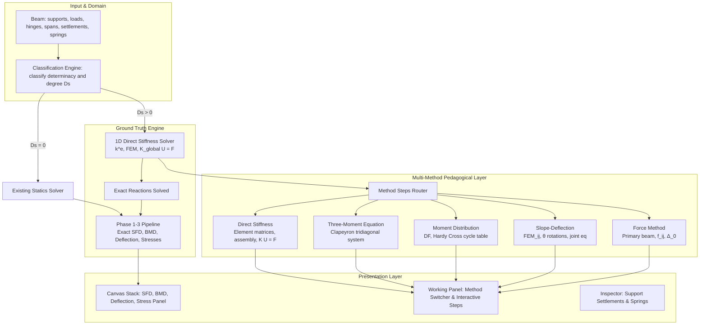

# Mechanics Sight — Project Plan

A free, open-source visual workspace for civil and structural engineering: understand a concept, solve a problem, inspect the calculation, compare alternatives, and share the result. The existing straight-beam solver is the foundation for a broader collection of connected tools and learning labs.

This plan replaces `prompt.md` and `prompt 2.md`. Section 14 records decisions from those drafts. Sections 1–13 describe the beam foundation and its recorded implementation status; Sections 15–19 describe the expanded product direction and future work.

**Planning update — 2026-10-01:** prioritize a simpler workspace UX and steel education, beginning with a strain-controlled Steel Material Lab. Concrete/RCC is deferred. The new roadmap is planned work, not an implementation or release claim. Existing P3 and M0–M10 status entries remain unchanged by this planning update.

---

## 1. Core idea — beam solver foundation

Treat every load the same way, including the unknown reactions. Each load answers a few questions: how much does it push up, how much does it turn the beam about a point, and what does it add to V and M in a segment. Reactions, SFD, BMD, and later deflection and indeterminate beams all reuse that one interface.

One general method computes the answer. Hand-calculation tricks (free-end moments, "area of SFD = change in BM", "M is maximum where V = 0") become **tests**, not code paths.

---

## 2. Scope

Each beam-solver phase must meet its release criteria before it is marked complete. The future labs in Sections 15–19 have their own bounded milestones; adding a lab does not extend the beam solver's supported physics automatically.

### Phase 1 — statically determinate beams, vertical loads only

| Item | Decision |
|---|---|
| Supports | `PIN`, `ROLLER`, `FIXED`. A free end is simply "no support" and is **not** an enum member. |
| Support positions | Pin and roller: anywhere in [0, L]. Fixed: only at x = 0 or x = L. At most one support at any position. |
| Stability and determinacy | Found from the directions each support restrains (Section 6). The beam is classified first as unstable, determinate, or indeterminate with its degree, and only then solved. There are no hard-coded rules for particular support combinations. |
| Beam types covered | Simply supported, cantilever (fixed at either end), overhanging on one or both sides, pin–pin. The type is never stored; it follows from the supports. |
| Loads | Point load, point moment (couple), distributed load (UDL, triangular, trapezoidal, full or partial). Any number, overlapping allowed. |
| Distributed load sign | `w_start` and `w_end` must not have opposite signs (zero is allowed). Users model a sign-changing load as two loads. |
| Cross-section / material | Not needed. SFD and BMD come from statics alone. |
| Indeterminate input | Indeterminate in bending (propped cantilever, three supports, and so on) → `IndeterminateBeamError` giving the degree, never a wrong answer. Indeterminate only in the axial direction (pin–pin) → solved exactly (Section 6.4). |

Edge cases Phase 1 must handle: a load exactly on a support, a load at x = 0 or x = L, a couple at the free end of a cantilever, a beam with no loads (all zeros, no crash), unstable setups (clear error), indeterminate setups (clear error).

### Phase 1.5 — API and basic web page
FastAPI endpoint and a React page with a form, stacked SFD/BMD graphs, and exact hover values.

### Phase 1.6 — drag and drop
Drag supports and loads on the beam, with snapping and live updates.

### Phase 2 — still statics, more setups
- Internal hinges (Gerber / compound beams).
- Horizontal and inclined point loads, plus an Axial Force Diagram (AFD).
- Optional: guided (sliding) support.

### Phase 3 — deflection
Constant EI, then a cross-section library (rectangle, circle, I, T) with E, then stepped beams (EI changes along the length). Slope and deflection diagrams. Bending and shear stresses.

### Phase 4 — statically indeterminate beams & multi-method pedagogical engine
- Arbitrarily indeterminate beams ($D_s \ge 1$): propped cantilevers ($D_s = 1$), fixed–fixed beams ($D_s = 2$), multi-span continuous beams ($D_s = N - 1$).
- Physical non-ideal boundary conditions: support settlements ($\delta$, downward displacement), vertical and rotational elastic spring supports ($k_y, k_\theta$).
- Multi-pinned/fixed axial compatibility under horizontal loading ($\int \frac{N}{EA} \, dx = 0$).
- Ground-truth 1D Euler–Bernoulli direct stiffness solver for exact reactions, preserving continuous piecewise polynomial SFD/BMD, deflection, and stress distributions.
- Multi-method pedagogical switcher allowing students to inspect worked derivation steps under:
  1. Force Method (Consistent Deformations / Flexibility)
  2. Slope-Deflection Method
  3. Moment Distribution Method (Hardy Cross Table)
  4. Theorem of Three Moments (Clapeyron)
  5. Direct Stiffness Matrix Method (1D FEM)

### Current beam-solver boundary (Phases 1–4)

The following remain outside the current beam solver, as reflected in the README. Some are deferred product modules in Section 19; listing them in the future roadmap does not make them supported analysis cases today.

- Moving loads and influence lines
- Frames, trusses, curved beams
- 3D, torsion, bending about two axes
- Dynamics and vibration
- Large deflection, material yielding, P-Δ effects (anything non-linear)
- Shear deformation (Timoshenko). The project uses Euler–Bernoulli beams only.
- Distributed axial loads, distributed couples, thermal loads
- Units other than SI. Converting polynomial coefficients needs a different factor per power, so this is not an "edge only" change.

**Product positioning:**
Mechanics Sight combines free access, open source, connected visual explanations, transparent calculations, and progressively supported Indian engineering references. Existing products already provide calculators, educational visualizations, and connected design workflows; these individual features are not claimed as inventions. The product should earn repeat use through clarity, reliable calculations, and less repeated data entry. Exact piecewise beam polynomials are a strength within the current model assumptions; future modules should use methods appropriate to their physics.

**Why frames and trusses are deferred:**
Straight beams operate on a 1D coordinate $x \in [0, L]$ with piecewise integration. Frames and trusses require node/member models, coordinate transformations, stiffness assembly, and member-local diagrams. They are future modules with a separate analysis design and validation effort. A 3D view of a supported beam or specimen is a visualization feature and does not imply a 3D structural solver.

**Why write this down:** the code can give an honest error instead of a wrong answer, and a clearly limited project that works well is worth more than a large one that half-works.

---

## 3. Conventions (fixed before any code)

These go into `docs/SIGN_CONVENTIONS.md` in milestone M0 and are used identically in the domain, the solver, the API and the UI.

### Units
SI only: m, kN, kN·m, kN/m. The API sends and receives these same units. The UI may *display* deflection in mm (Phase 3), but it never sends converted numbers to the backend.

### Coordinates and signs

| Quantity | Positive direction |
|---|---|
| Position x | From the left end, 0 ≤ x ≤ L |
| Forces, reactions, distributed intensity w | Upward |
| Applied couples, reaction moments, all equilibrium moments | Anticlockwise |
| Internal shear V(x) | Sum of vertical forces to the left of the cut (the left part is pushed up) |
| Internal moment M(x) | Sagging |
| Horizontal forces and reactions | To the right |
| Axial force N(x) (Phase 2) | Tension |
| Deflection y, slope θ (Phase 3) | Upward, anticlockwise |

A downward 10 kN load is stored as −10. A clockwise 12 kN·m couple is stored as −12. The UI shows direction toggles (↓/↑, ↻/↺) and a positive magnitude, then stores the signed value. There is **one** sign convention everywhere, including in the API.

### The two section rules (left and right)

For a cut at x:

```
From the left:   V(x) = + Σ (forces left of x)
                 M(x) = − Σ (anticlockwise moments about x of the loads left of x)

From the right:  V(x) = − Σ (forces right of x)
                 M(x) = + Σ (anticlockwise moments about x of the loads right of x)
```

What follows from these rules (all checked in tests):
- An upward point load F at a < x adds F·(x − a) to M. This is sagging, as expected.
- An anticlockwise couple C makes the BMD **drop** by C (going left to right). A clockwise couple makes it **jump up**, which matches the textbooks.
- dV/dx = w and dM/dx = V.
- Just to the right of x = L, both V and M must be zero. This is global equilibrium, and the analysis checks it on every run.

**Why the "left" rule is primary:** each load then only has to answer "what do I add to V and M at a point to my right?". The right-side rule exists so the tests can compute the same answer a second, independent way.

### Tolerances (`beam_solver/tolerances.py`, the only place they are defined)
- `POSITION_TOL = 1e-6` m. Two positions closer than this are the same point. They are compared with helpers such as `same_position(a, b)`, never `==`.
- Value tolerance is relative to the size of the loads: `scale = max(1, Σ|F| + Σ|W| + Σ|C|/L)`. Forces use `1e-9·scale` and moments use `1e-9·scale·L`. This decides "is this zero?" for extremes, coefficient trimming and residual checks.

---

## 4. Architecture

### Repository layout

```
mechanics-sight/
  README.md
  plan.md
  docs/
    SIGN_CONVENTIONS.md
    hand-solutions/            # scanned or typed hand solutions for the test cases
  shared/
    fixtures/                  # contract fixtures used by backend AND frontend tests
    openapi.json               # exported from FastAPI, committed
  backend/
    pyproject.toml
    src/beam_solver/
      __init__.py              # public API: Beam, Support, loads, analyze, errors
      errors.py
      tolerances.py
      domain/
        supports.py            # SupportKind, Support
        loads.py               # Load ABC, PointLoad, PointMoment, DistributedLoad
        beam.py                # Beam + validation
      solvers/
        equilibrium.py         # Unknown, EquilibriumSystem (A, b, axial/bending blocks)
        classification.py      # Determinacy, Classification, classify()
        reactions.py           # solve_reactions(), Reaction
      analysis/
        segments.py            # segment polynomials
        critical_points.py
        extremes.py
        results.py             # result dataclasses
        analyze.py             # analyze(beam) -> AnalysisResult
      io/
        schemas.py             # pydantic models (API/CLI JSON format)
        convert.py             # schema <-> domain / results
      plotting/
        diagrams.py            # matplotlib
      api/
        app.py                 # FastAPI app
        errors.py              # exception -> error envelope
      cli.py
    tests/
  frontend/
    package.json
    src/
```

### Layer rules (enforced with `import-linter` in CI)

```
api, cli            (top)
io, plotting
analysis
solvers
domain              (bottom)
errors, tolerances  (usable by all)
```

A layer may import only from layers below it. The physics (`domain`, `solvers`, `analysis`) never imports pydantic, FastAPI or matplotlib.

**Why:** the web API becomes "JSON → Beam → analyze → JSON", and none of the maths changes when the UI arrives. The linter makes the rule impossible to break by accident.

### Dependencies
- Core: `numpy>=2`, `pydantic>=2` (for `io`)
- Optional extra `plot`: `matplotlib`
- Optional extra `api`: `fastapi`, `uvicorn`
- Dev: `pytest`, `pytest-cov`, `hypothesis`, `mypy`, `ruff`, `import-linter`, `sympy` (cross-checks only), `pre-commit`

---

## 5. Domain model

All domain classes are `@dataclass(frozen=True)`. Collections are `tuple`s, never `list`s. (`frozen=True` alone does not stop a list from being changed.) Every support and load has a string `id`, which must be unique within the beam. Reactions refer back to supports by this id, and the UI uses it for selection and dragging.

### Errors (`errors.py`)
Each error has a `code` string that the API uses directly.

```
BeamError                      (base)
├── InvalidBeamError           code "invalid_beam"
│   ├── InvalidPositionError   code "invalid_position"
│   ├── InvalidLoadError       code "invalid_load"
│   └── InvalidSupportError    code "invalid_support"
├── UnstableBeamError          code "unstable"
├── IndeterminateBeamError     code "indeterminate"
└── SolverConsistencyError     code "internal_error"   (a bug in our code, never a user error)
```

`UnstableBeamError` and `IndeterminateBeamError` carry the `Classification` (Section 6.2), so the message and the API can say exactly why.

### Supports

```python
class Direction(Enum):
    X = "x"                # horizontal translation
    Y = "y"                # vertical translation
    ROTATION = "rotation"

class SupportKind(Enum):
    PIN = "pin"
    ROLLER = "roller"
    FIXED = "fixed"

RESTRAINTS: Mapping[SupportKind, tuple[Direction, ...]] = {
    SupportKind.ROLLER: (Direction.Y,),
    SupportKind.PIN:    (Direction.X, Direction.Y),
    SupportKind.FIXED:  (Direction.X, Direction.Y, Direction.ROTATION),
}

@dataclass(frozen=True)
class Support:
    id: str
    kind: SupportKind
    position: float

    @property
    def restraints(self) -> tuple[Direction, ...]:
        return RESTRAINTS[self.kind]
```

Each restrained direction produces one unknown reaction. A new support type is just one new row in `RESTRAINTS`, for example `GUIDED: (X, ROTATION)` in Phase 2. The classifier and the solver don't change.

### Loads

```python
class Load(ABC):
    id: str

    @abstractmethod
    def resultant(self) -> float:
        """Total vertical force, upward positive (kN)."""

    @abstractmethod
    def moment_about(self, x0: float) -> float:
        """Moment about x0, anticlockwise positive (kN·m)."""

    @abstractmethod
    def breakpoints(self) -> tuple[float, ...]:
        """Positions where this load starts, ends or acts."""

    @abstractmethod
    def section_polynomials(self, x0: float) -> tuple[Polynomial, Polynomial]:
        """Contribution to V and M on a segment starting at x0, as polynomials
        in the local coordinate t = x - x0. Valid only when none of this load's
        breakpoints lies strictly inside the segment."""

    @abstractmethod
    def split(self, x: float) -> tuple[Load | None, Load | None]:
        """The parts of this load left and right of x. A point load exactly
        at x goes to the left."""
```

`Polynomial` is `numpy.polynomial.Polynomial` (coefficients in ascending order).

**Why two routes to V and M:** production code uses `section_polynomials`. The tests compute the same values a second way, using `split` + `resultant` + `moment_about` with the right-side rule. If both routes agree everywhere, the formulas are consistent. Adding a new load type means writing one class and touching nothing else (Open/Closed principle).

#### Formulas

The loads are `PointLoad(id, position a, magnitude F)`, `PointMoment(id, position a, magnitude C)` and `DistributedLoad(id, start a, end b, w_start w₁, w_end w₂)`, with l = b − a and k = (w₂ − w₁)/l.

| Load | `resultant` | `moment_about(x0)` |
|---|---|---|
| Point load | F | F·(a − x0) |
| Couple | 0 | C |
| Distributed | (w₁ + w₂)·l/2 | rectangle + triangle (below) |

The distributed load is split into a **rectangle** (w₁·l acting at a + l/2) and a **triangle** ((w₂ − w₁)·l/2 acting at a + 2l/3). Each piece is added as force × (position − x0). There is no centroid formula and no division, so w₁ + w₂ = 0 can never divide by zero.

`section_polynomials(x0)` (in t = x − x0):

| Case | V(t) | M(t) |
|---|---|---|
| Point load, a ≤ x0 | F | F·(x0 − a) + F·t |
| Couple, a ≤ x0 | 0 | −C |
| Distributed, fully left (b ≤ x0) | W | −moment_about(x0) + W·t |
| Distributed, spanning (a ≤ x0 < b) | w₁u + k·u²/2 | w₁u²/2 + k·u³/6 |
| Load to the right of x0 | 0 | 0 |

For the spanning case, u = t + (x0 − a). Build the polynomial in u and shift it with `P(Polynomial([x0 - a, 1]))`. All "≤" comparisons use `POSITION_TOL`.

Degree bounds: V ≤ 2 and M ≤ 3 in every segment. These are asserted in the tests.

### Beam

```python
@dataclass(frozen=True)
class Beam:
    length: float
    supports: tuple[Support, ...]
    loads: tuple[Load, ...] = ()
```

`__post_init__` checks the following, raising the matching `InvalidBeamError` subclass:
- `length` is finite and > 0
- every position (supports, load positions, load starts and ends) lies in [0, L] within tolerance
- at least one support
- ids are unique across supports and loads
- no two supports at the same position
- `FIXED` only at x = 0 or x = L
- distributed loads: `end − start > POSITION_TOL`, and `w_start`, `w_end` not of opposite sign
- all numbers are finite (no NaN or inf)

The domain does **not** change positions (no snapping). It accepts values within tolerance and compares with tolerance. Snapping belongs to the UI.

---

## 6. Classification and reaction solver

The first step of every analysis is to classify the beam from its support restraints. Only a beam that passes is solved.

### 6.1 The equilibrium system A·r = b
- **Unknowns r:** one per restrained direction of every support (Section 5). Each unknown knows its support id, position and direction.
- **Equations:** ΣFx = 0, ΣFy = 0, ΣM about x = 0 equals 0, plus one M(x_h) = 0 row per internal hinge from Phase 2. So there are **e = 3 + h** equations, where h is the number of hinges (0 in Phase 1).
- **Columns of A, built by reusing the Load interface:** every unknown becomes a **unit load** at its position.

| Direction | Unit load | Column (ΣFx, ΣFy, ΣM) |
|---|---|---|
| X | unit horizontal force | (1, 0, 0) |
| Y | `PointLoad(1.0)` | (0, `resultant()`, `moment_about(0)`) = (0, 1, x) |
| ROTATION | `PointMoment(1.0)` | (0, 0, `moment_about(0)`) = (0, 0, 1) |

- **b** = −(Σ applied horizontal forces, Σ `resultant()`, Σ `moment_about(0)`). The horizontal term is 0 in Phase 1.

**Why unit loads:** the solver has no formulas of its own. A sign mistake could only live in the load classes, where the unit tests catch it.

`EquilibriumSystem` builds A, b and the list of unknowns once. Both `classify()` and `solve_reactions()` use it.

### 6.2 Classification: count first, then rank
Let r be the total number of restraints and e = 3 + h:

1. **Count (the textbook formula):**
   - r < e → **unstable**: too few restraints.
   - r = e → determinate, *if* step 2 passes.
   - r > e → indeterminate to degree r − e, *if* step 2 passes.
2. **Rank:** if `np.linalg.matrix_rank(A) < e` → **unstable**, even when the count looks fine. The restraints are arranged so that some movement is still free.

   Example: three rollers give r = 3 = e, but nothing resists horizontal movement. The ΣFx row of A is all zeros, so the rank is 2.

**Why both steps:** the count is necessary but not sufficient. rank(A) = e means every equilibrium equation can be satisfied for *any* load, which is exactly what "stable" means. Step 1 is implied by step 2, since the rank can never exceed r, but it is kept because it gives a clearer message.

```python
class Determinacy(Enum):
    UNSTABLE = "unstable"
    DETERMINATE = "determinate"
    INDETERMINATE = "indeterminate"

@dataclass(frozen=True)
class Classification:
    status: Determinacy
    restraints: int         # r
    equations: int          # e = 3 + h
    axial_degree: int       # see 6.3 (meaningful only when stable)
    bending_degree: int
    reason: str | None      # plain-language cause when unstable

    @property
    def degree(self) -> int:
        return self.axial_degree + self.bending_degree   # equals r − e when stable
```

### 6.3 Axial and bending parts are independent
All loads and reactions act on the beam axis, so a horizontal force has no lever arm about any point on it. Horizontal unknowns therefore appear **only** in the ΣFx row, and ΣFy, ΣM and the hinge rows never contain them. A splits into two independent blocks:

| Block | Equations | Unknowns | Stable when | Degree |
|---|---|---|---|---|
| Axial | ΣFx (1) | X restraints (r_a) | r_a ≥ 1 | r_a − 1 |
| Bending | ΣFy, ΣM, hinge rows (2 + h) | Y and ROTATION restraints (r_b) | rank(A_b) = 2 + h | r_b − (2 + h) |

The beam is stable only if both blocks are stable. The two degrees add up to r − (3 + h), which is the textbook formula again, but now the result also says **where** the indeterminacy is.

Unstable messages come from the block that failed:
- Axial: "Nothing resists horizontal movement: add a pin or fixed support."
- Bending, count: "Too few vertical or rotational restraints (have r_b, need at least 2 + h)."
- Bending, rank: "The supports are arranged so that part of the beam can move freely."

### 6.4 What Phase 1 solves

| Classification | Phase 1 behaviour |
|---|---|
| Unstable | `UnstableBeamError` with the reason |
| Bending degree > 0 | `IndeterminateBeamError("indeterminate to degree n in bending; supported from Phase 4")` |
| Both degrees 0 | Solve |
| Bending degree 0, axial degree > 0 (for example pin–pin) | Solve the bending block and set the horizontal reactions to 0, with a note in `warnings`. |

Setting the horizontal reactions to 0 in that last row is **exact, not an assumption**. With no horizontal loads, the axial force between the X restraints is the same everywhere. The beam's total change of length between them must be zero, so that axial force is zero whatever EA is. (Temperature change is out of scope.) In Phase 2, once horizontal loads exist, this case becomes `IndeterminateBeamError` until Phase 4 adds axial compatibility.

### 6.5 Solving
- Solve each determinate block with `np.linalg.solve`. The axial block is a single equation.
- **Residual check:** if `‖A·r − b‖` is above tolerance → `SolverConsistencyError`.
- A raw `numpy.linalg.LinAlgError` never escapes the solver.

### 6.6 Output
`Reaction(support_id, fx, fy, moment)`. Components the support doesn't restrain are 0.0.

The reactions are turned into load objects and combined with the applied loads in a **new** tuple inside the analysis layer. The `Beam` is never changed.

### 6.7 Classification examples (also a parametrized test)

| Supports | r | e | rank(A) | Result |
|---|---|---|---|---|
| Roller | 1 | 3 | – | Unstable: r < e |
| Roller + roller | 2 | 3 | – | Unstable: r < e (axial block has no restraint) |
| Pin | 2 | 3 | – | Unstable: r < e |
| Roller + roller + roller | 3 | 3 | 2 | **Unstable:** the count passes, but nothing resists horizontal movement |
| Pin + roller | 3 | 3 | 3 | Determinate |
| Fixed | 3 | 3 | 3 | Determinate |
| Pin + pin | 4 | 3 | 3 | Indeterminate, degree 1 (axial only) → solved, H = 0 |
| Fixed + roller | 4 | 3 | 3 | Indeterminate, degree 1 (bending) → Phase 4 |
| Pin + roller + roller | 4 | 3 | 3 | Indeterminate, degree 1 (bending) → Phase 4 |
| Fixed + pin | 5 | 3 | 3 | Indeterminate, degree 2 (1 axial + 1 bending) → Phase 4 |
| Fixed + fixed | 6 | 3 | 3 | Indeterminate, degree 3 (1 axial + 2 bending) → Phase 4 |
| Fixed 0, hinge 3, roller 6 (Phase 2) | 4 | 4 | 4 | Determinate |
| Fixed 0, roller 1, hinge 3 (Phase 2) | 4 | 4 | 3 | **Unstable:** nothing supports the part right of the hinge |

---

## 7. Analysis

`analyze(beam: Beam) -> AnalysisResult`

### 7.1 Critical points
The sorted positions {0, L} ∪ support positions ∪ every load's `breakpoints()` (reactions included), with positions within `POSITION_TOL` merged. Points where V = 0 are **not** critical points; they are reported separately (7.4).

### 7.2 Segments
Each pair of neighbouring critical points is one segment `[x_start, x_end]`. On each segment:
- V = Σ `section_polynomials(x_start)[0]` over all loads, reactions included
- M = Σ `section_polynomials(x_start)[1]`

Coefficients are stored as `tuple[float, ...]`, ascending, in **local t = x − x_start**. Trailing coefficients below the value tolerance are dropped, but at least one coefficient is always kept.

**Why local coordinates:** coefficients in global x lose precision far along the beam. At x ≈ 40 m, the x³ term is about 64,000, so the value you actually want becomes a small difference between huge numbers.

### 7.3 Values at critical points
`CriticalPoint(x, shear_left, shear_right, moment_left, moment_right)`:
- At x = 0: the left values are 0. The right values come from segment 0 at t = 0.
- At an interior point: the left values come from the previous segment at t = its length; the right values from the next segment at t = 0.
- At x = L: the left values come from the last segment. The right values are Σ resultant and −Σ moment_about(L) over all loads. These **must** be zero within tolerance, otherwise `SolverConsistencyError`. They are then stored as exactly 0.0.

This replaces the "evaluate at x ± ε" idea: the values are exact, and there is no ε to choose.

### 7.4 Extremes and zero shear
Everything is computed from the polynomials, exactly:
- **Moment candidates:** the left and right M at every critical point, plus M at every real root of V strictly inside a segment (`Polynomial.roots()`, keeping roots with |imag| below tolerance and t in (0, h)). A segment where V ≡ 0 has constant M; its endpoints already cover it.
- **Shear candidates:** the left and right V at every critical point, plus V at the roots of V′ (= w) inside a segment. That only happens when overlapping loads make the net w cross zero.
- `max_sagging`: the largest positive moment and its x, or `None` if no moment exceeds the tolerance. `max_hogging`: the most negative, or `None`. `max_positive_shear` and `max_negative_shear` are defined the same way.
- Ties go to the **leftmost** x.
- `zero_shear_points`: the roots of V inside segments, plus critical points where V changes sign across the jump (shear_left · shear_right < 0).

The largest moment can occur at a V = 0 root, at a point load where V jumps across zero, at a couple, or at a fixed end. That is why all the candidates are checked, not only the V = 0 points.

### 7.5 Result dataclasses (`analysis/results.py`)

```python
class Side(Enum): LEFT = "left"; RIGHT = "right"

@dataclass(frozen=True)
class Segment:
    x_start: float
    x_end: float
    shear: tuple[float, ...]    # ascending coefficients in t = x - x_start
    moment: tuple[float, ...]

@dataclass(frozen=True)
class CriticalPoint:
    x: float
    shear_left: float
    shear_right: float
    moment_left: float
    moment_right: float

@dataclass(frozen=True)
class Extreme:
    x: float
    value: float

@dataclass(frozen=True)
class AnalysisResult:
    classification: Classification
    reactions: tuple[Reaction, ...]
    segments: tuple[Segment, ...]
    critical_points: tuple[CriticalPoint, ...]
    zero_shear_points: tuple[float, ...]
    max_sagging: Extreme | None
    max_hogging: Extreme | None
    max_positive_shear: Extreme | None
    max_negative_shear: Extreme | None
    warnings: tuple[str, ...]

    def shear_at(self, x: float, *, side: Side) -> float: ...
    def moment_at(self, x: float, *, side: Side) -> float: ...
    def sample(self, points_per_segment: int = 100) -> SampledDiagram: ...
```

`side` is a required keyword, so no caller can silently pick a side at a jump. Away from critical points, both sides give the same value.

The same result object feeds the matplotlib plots, the CLI and the API. The API simply turns it into JSON.

### 7.6 Plotting (`plotting/diagrams.py`)
Stacked beam sketch, SFD and BMD sharing one x-axis. Sample 100 points per segment, always including the exact segment ends. Draw a vertical line at each jump (left value → right value). Mark the reactions, the extremes and the zero-shear points.

---

## 8. Testing strategy

### 8.1 Hand-solved cases (M0, written before any solver code)
Solve each by hand. Store the solutions in `docs/hand-solutions/` and as `shared/fixtures/*.json` (Section 8.4). Signs follow Section 3; all values are in kN, m, kN·m.

| # | Setup | Expected |
|---|---|---|
| 1 | SS: pin 0, roller 6. Point load −10 at 3 | R = 5, 5. V = +5 / −5. M(3) = +15 (= PL/4). No hogging. |
| 2 | SS: pin 0, roller 6. UDL −2 over 0–6 | R = 6, 6. Zero shear at 3. max_sagging = 9 at 3 (= wL²/8). |
| 3 | Cantilever fixed at 0, L = 4. UDL −3 over 0–4 | R = 12, reaction moment **+24** (anticlockwise). M(0⁺) = **−24** (= −wL²/2). No sagging. |
| 4 | Cantilever fixed at 4 (right end). Point load −5 at 0 | R = 5, reaction moment **−20**. V = −5 throughout. M(4⁻) = −20. |
| 5 | Overhang: pin 0, roller 4, L = 6. Point load −10 at 6 | R_pin = **−5** (downward), R_roller = 15. V = −5 then +10. max_hogging = −20 at 4. No sagging. |
| 6 | SS: pin 0, roller 6. Clockwise couple 12 (stored −12) at 2 | R = −2, +2. V = −2 throughout. M(2⁻) = −4, M(2⁺) = +8 (jump **up** by 12). |
| 7 | SS: pin 0, roller 6. Triangular load 0 → −3 over 0–6 | R = 3, 6. Zero shear at 6/√3 ≈ 3.4641. max_sagging = 4√3 ≈ 6.9282 (= w₀L²/(9√3)). |
| 8 | SS: pin 0, roller 8. UDL −4 over 2–6 (partial) | R = 8, 8. max_sagging = 24 at 4. |
| 9 | SS: pin 0, roller 6. Point load −10 at 0 (on the pin) | R = 10, 0. V ≡ 0, M ≡ 0 inside. Critical point at 0: left 0, right 0. |
| 10 | Cantilever fixed at 0, L = 4. Anticlockwise couple 8 at 4 (free end) | R = 0, reaction moment −8. M ≡ +8. max_sagging = 8 at 0 (leftmost tie). |
| 11 | SS: pin 0, roller 5. No loads | Everything zero. All extremes `None`. No crash. |
| 12 | Pin 0, **pin** 6. Point load −10 at 3 | Same V and M as case 1. Reactions fx = 0, fy = 5 at both pins. Classified as indeterminate, degree 1 (axial only), with a note in `warnings`. |

### 8.2 Error cases

| Setup | Expected |
|---|---|
| Single roller | `UnstableBeamError` (r = 1 < 3) |
| Two rollers | `UnstableBeamError` (r = 2 < 3) |
| Single pin | `UnstableBeamError` (r = 2 < 3) |
| Three rollers | `UnstableBeamError` (the count passes, rank 2 < 3: nothing resists horizontal movement) |
| Fixed + roller (propped cantilever) | `IndeterminateBeamError`, degree 1 |
| Pin + roller + roller | `IndeterminateBeamError`, degree 1 |
| Fixed + fixed | `IndeterminateBeamError`, degree 3 |
| Pin and roller both at x = 3 | `InvalidSupportError` |
| Fixed support at x = 2 on a 6 m beam | `InvalidSupportError` |
| Load at x = 7 on a 6 m beam | `InvalidPositionError` |
| Distributed load from +2 to −2 | `InvalidLoadError` |
| No supports, duplicate ids, L ≤ 0, NaN values | `InvalidBeamError` subclasses |

The whole Section 6.7 table is also a parametrized test of `classify()`.

### 8.3 Invariant (property) tests
Run them on the hand cases **and** on random determinate beams generated with `hypothesis` (random pin–roller, overhanging and cantilever beams with random loads):
1. **Left vs right:** at many x, V and M from the segment polynomials equal V and M from the right-side rule, which is computed independently with `split` + `resultant` + `moment_about`. This catches disagreements between the two routes. It does **not** catch a helper that is wrong the same way in both routes, which is why the hand cases exist.
2. **Calculus:** in every segment, `M.deriv() == V` and `V.deriv() == w`, compared coefficient by coefficient within tolerance. (This replaces the trapezoid-area check: the polynomials are exact, so compare them exactly.)
3. **Degree:** deg V ≤ 2 and deg M ≤ 3.
4. **Closure:** V and M just right of L are zero.
5. **Per load:** for every load type, `section_polynomials` evaluated beyond the load's end equals (`resultant()`, `−moment_about(x)`).
6. **Moment jumps** at a critical point equal minus the couples there. **Shear jumps** equal the point forces there.

### 8.4 Contract fixtures (`shared/fixtures/`)
Each hand case is one JSON file with three parts:
- `input`: the API request body
- `checks`: the hand-solved values, e.g. `{"x": 3, "side": "left", "moment": 15}`
- `output`: the API response snapshot, generated by a script and reviewed before committing

The backend tests check that `analyze(input)` matches `output` and satisfies `checks`. The frontend tests (Vitest) evaluate the polynomials in `output` and check them against `checks`. This catches coefficient-order and local/global coordinate mistakes on **both** sides with one set of files.

### 8.5 SymPy cross-check
`sympy.physics.continuum_mechanics.beam.Beam` uses its own sign convention. Establish the mapping once on case 1, write it down in the test module, then compare reactions and moments for the other hand cases. It is a dev-only dependency and is never used by the solver.

### 8.6 Indeterminate benchmark cases matrix (Phase 4)

Reference targets for independent checks, not a claim that every listed method's worked derivation has been verified. Track numerical and teaching-content evidence separately in Section 20.

Assume uniform positive $EI$, small-displacement linear elasticity and no support settlement unless stated. Coordinates run from the left end; a propped cantilever is fixed at the left. Inputs use signed vertical loads $w<0$ and $P<0$; the formulas below use their positive downward magnitudes $q=|w|$ and $p=|P|$. Reactions are positive upward. Listed end/wall moments are internal sagging-positive bending moments, not external support reaction couples. In equal-span cases, $L$ means one span length.

| # | Indeterminate Setup | Closed-Form Analytical Solution | Methods to cross-check |
|---|---|---|---|
| I-1 | Propped cantilever ($L=6$), UDL $w=-2$ | $R_{\text{roller}} = \frac{3}{8}qL = 4.5\text{ kN}$, $R_{\text{fixed}} = \frac{5}{8}qL = 7.5\text{ kN}$, $M_{\text{wall}} = -\frac{1}{8}qL^2 = -9\text{ kN}\cdot\text{m}$, $M_{\max} = \frac{9}{128}qL^2 = +5.0625\text{ kN}\cdot\text{m}$ at $x = 5L/8 = 3.75\text{ m}$ | Force Method, Slope-Deflection, Direct Stiffness |
| I-2 | Propped cantilever ($L=6$), Midspan Point Load $P=-12$ at $x=3$ | $R_{\text{roller}} = \frac{5}{16}p = 3.75\text{ kN}$, $R_{\text{fixed}} = \frac{11}{16}p = 8.25\text{ kN}$, $M_{\text{wall}} = -\frac{3}{16}pL = -13.5\text{ kN}\cdot\text{m}$, $M_{\text{load}} = \frac{5}{32}pL = +11.25\text{ kN}\cdot\text{m}$ | Force Method, Slope-Deflection, Direct Stiffness |
| I-3 | Fixed–fixed beam ($L=6$), UDL $w=-2$ | $R_A = R_B = \frac{qL}{2} = 6\text{ kN}$, $M_A = M_B = -\frac{1}{12}qL^2 = -6\text{ kN}\cdot\text{m}$, $M_{\text{mid}} = +\frac{1}{24}qL^2 = +3\text{ kN}\cdot\text{m}$, inflection at $x = L(1 \pm 1/\sqrt{3})/2 \approx 1.268\text{ m}, 4.732\text{ m}$ | Slope-Deflection, Moment Distribution, Direct Stiffness |
| I-4 | Fixed–fixed beam ($L=6$), Midspan Point Load $P=-12$ at $x=3$ | $R_A = R_B = \frac{p}{2} = 6\text{ kN}$, $M_A = M_B = -\frac{1}{8}pL = -9\text{ kN}\cdot\text{m}$, $M_{\text{mid}} = +\frac{1}{8}pL = +9\text{ kN}\cdot\text{m}$, inflection points at quarter points $x = 1.5\text{ m}, 4.5\text{ m}$ | Slope-Deflection, Moment Distribution, Direct Stiffness |
| I-5 | 2-Span continuous beam ($L_1=4, L_2=4$), UDL $w=-3$ | $R_A = R_C = \frac{3}{8}qL = 4.5\text{ kN}$, $R_B = \frac{10}{8}qL = 15.0\text{ kN}$, intermediate hogging $M_B = -\frac{1}{8}qL^2 = -6\text{ kN}\cdot\text{m}$ | Three-Moment (Clapeyron), Moment Distribution, Slope-Deflection, Direct Stiffness |
| I-6 | 3-Span continuous beam ($L_1=L_2=L_3=4$), UDL $w=-2$ | $R_1 = R_4 = 0.4qL = 3.2\text{ kN}$, $R_2 = R_3 = 1.1qL = 8.8\text{ kN}$, support moments $M_2 = M_3 = -0.1qL^2 = -3.2\text{ kN}\cdot\text{m}$ | Three-Moment, Moment Distribution, Direct Stiffness |
| I-7 | Propped cantilever, full-span UDL of downward magnitude $q$, roller settlement $\delta = 5\text{ mm}$ downward | $R_B = \frac{3}{8}qL - \frac{3EI\delta}{L^3}$; assume a bilateral support, so negative reaction is permitted. Specify $L$, $EI$ and $q$ before creating a numerical fixture. | Force Method, Direct Stiffness |
| I-8 | Left-fixed cantilever, vertical tip spring $k_y = 500\text{ kN/m}$, downward tip point load of magnitude $p$ only | Downward displacement magnitude $d = \frac{pL^3}{3EI + k_y L^3}$; signed displacement $v_{\text{tip}}=-d$, upward spring reaction $R_y=-k_yv_{\text{tip}}$. Specify $L$, $EI$ and $p$ for a numerical fixture. | Force Method, Direct Stiffness |
| I-9 | Multi-pinned beam under horizontal forces, zero prescribed axial support movement and no initial strain | Impose $\int_{x_i}^{x_{i+1}} \frac{N(x)}{EA} \, dx = 0$ between each adjacent pair of axially restrained supports, together with equilibrium. Specify geometry, $EA$ and loads for numerical fixtures. | Direct Stiffness |


---

## 9. Coding standards (set up in M0)

Backend:
- `uv` for environments and the lock file, Python `>=3.12`, `src/` layout
- `ruff check` (rule sets E, F, I, B, UP, SIM, N, RUF, PT) and `ruff format`
- `mypy --strict`
- `pytest` + `hypothesis` + `pytest-cov`, with coverage ≥ 90% on `domain`, `solvers`, `analysis`
- `import-linter` for the layer rules
- Type hints on every function. Docstrings on every public class and function, stating units and signs.
- Custom exceptions only. No `print` in library code (use `logging`).
- `pre-commit` running ruff, mypy and the fast tests

Frontend:
- Vite + React + TypeScript (`strict: true`)
- ESLint + Prettier
- Vitest for pure helpers; Playwright for drag tests (Phase 1.6)

CI (GitHub Actions) on every push:
- **Backend:** ruff, format check, mypy, lint-imports, pytest with coverage
- **Frontend:** oxlint, `tsc -b`, vitest (which also runs the shared contract fixtures), production build
- **Contract:** export `openapi.json` from the app, regenerate the TypeScript types, and fail if either differs from what is committed

---

## 10. API (Phase 1.5)

### Endpoint
`POST /api/v1/analyze`. It is stateless: request in, result out.

### Request

```json
{
  "schema_version": 1,
  "length": 6.0,
  "supports": [
    {"id": "s1", "type": "pin",    "position": 0.0},
    {"id": "s2", "type": "roller", "position": 6.0}
  ],
  "loads": [
    {"id": "p1", "type": "point",       "position": 3.0, "magnitude": -10.0},
    {"id": "c1", "type": "moment",      "position": 2.0, "magnitude": 5.0},
    {"id": "d1", "type": "distributed", "start": 0.0, "end": 6.0, "w_start": -2.0, "w_end": -2.0}
  ]
}
```

Loads are a pydantic discriminated union on `type`. Limits (to protect the server): length ≤ 1000 m, ≤ 20 supports, ≤ 100 loads, ids ≤ 32 characters.

### Response

```json
{
  "schema_version": 1,
  "classification": {"status": "determinate", "degree": 0, "axial_degree": 0, "bending_degree": 0},
  "reactions": [{"support_id": "s1", "fx": 0.0, "fy": 5.0, "moment": 0.0}],
  "segments": [
    {"x_start": 0.0, "x_end": 3.0, "shear": [5.0], "moment": [0.0, 5.0]}
  ],
  "critical_points": [
    {"x": 3.0, "shear_left": 5.0, "shear_right": -5.0, "moment_left": 15.0, "moment_right": 15.0}
  ],
  "zero_shear_points": [3.0],
  "extremes": {
    "max_sagging": {"x": 3.0, "value": 15.0},
    "max_hogging": null,
    "max_positive_shear": {"x": 0.0, "value": 5.0},
    "max_negative_shear": {"x": 3.0, "value": -5.0}
  },
  "warnings": []
}
```

The contract rules, stated in the OpenAPI descriptions and in `docs/`:
- Polynomial coefficients are in **ascending** order, in the **local** coordinate t = x − x_start.
- Segment polynomials are valid **strictly inside** the segment. At a critical point, clients must use the `critical_points` left and right values.

### Errors
Every failure uses one envelope. Pydantic validation errors are converted into it too.

```json
{"error": {"code": "unstable",
           "message": "Nothing resists horizontal movement: add a pin or fixed support.",
           "details": {"classification": {"status": "unstable", "restraints": 2, "equations": 3}}}}
```

Codes: `invalid_input` (schema), `invalid_position`, `invalid_load`, `invalid_support`, `unstable`, `indeterminate` → HTTP 422. `internal_error` → HTTP 500 (logged).

For `unstable` and `indeterminate`, `details` contains the `classification`. The UI shows it as a badge, for example "Statically indeterminate, degree 1 (bending)". That is useful teaching information in itself.

### Versioning
- Later phases add **optional fields with defaults** (for example `fx: 0.0`, `hinges: []`), so every v1 request stays a valid request.
- `schema_version` changes only on a breaking change. The frontend owns a `migrate(beamJson)` function for old saved and shared beams.

### Working steps (M6.5)
The solver already builds the equilibrium system, so it also records how it got each number. `steps` is an optional list of items `{kind, group, title, symbolic, substituted, result, notes, x_start, x_end, at}` for reactions (ΣFy = 0, ΣM = 0), each segment's V(x) and M(x), and the zero-shear and extreme points. The math fields are LaTeX strings written by the backend (so the wording and notation live in one place); the frontend only renders them with KaTeX and uses `x_start`/`x_end`/`at` to pin the crosshair. The frontend still does no mechanics.
- It is returned only with `?steps=true`, so live analysis and dragging (M7) stay small and fast.
- It is an optional field with a default, so `schema_version` does not change (see Versioning).
- Steps come from the same computation as the numbers, so they cannot disagree with the diagrams.

### Performance
The solve takes a few milliseconds including validation. The network round trip dominates.

---

## 11. Frontend (Phase 1.5 and 1.6)

The detailed UI/UX design (layout, exact symbol geometry, interactions, diagrams, React structure) is in `docs/UI_DESIGN.md`.

This section records the original beam UI. Section 16 defines the planned workspace redesign; its layouts are not implemented by this planning update.

### Rule
The frontend never does mechanics. It evaluates polynomials (Horner's method), snaps positions, and draws. All physics lives in Python.

### State (`zustand`)

```
model:   beam                         (API request format; the only thing sent to the API or put in URLs)
         history { past[], future[] } (undo/redo)
draft:   beam | null                  (the beam during a drag)
result:  last good AnalysisResult, current error, request sequence number
ui:      selectedId, hover x, panel state
```

UI-only state (selection, hover, draft) never goes into `beam`. Ids are created on the client (`crypto.randomUUID()`).

### Types
`openapi-typescript` generates `src/api/schema.d.ts` from `shared/openapi.json`. When a field is renamed in Python, the frontend stops compiling until it is fixed there too.

### Validation
Pydantic is the authority. The frontend does light checks only, for a better user experience: position within [0, L], end > start, and similar.

### Layout
Stacked panels sharing **one** `d3-scale` x-scale:

```
[ beam with supports and loads — drag here ]
[ SFD                                      ]
[ BMD                                      ]
[ (Phase 3) slope, deflection              ]
```

- Graphs are plain SVG with `d3-scale` and `d3-shape`. Plotly is not used, because syncing hover across charts and drawing jumps is awkward there.
- Curves are sampled from the segment polynomials at about one point per 2 px of width. Every jump is drawn as a vertical line from the left value to the right value.
- Reactions, extremes and zero-shear points are marked directly on the graphs.

### Hover
- One vertical line runs through all panels, with a small box showing V and M at that x.
- If the pointer is within **6 px** of a critical point, the hover snaps to it and shows both sides, for example "V = +5 kN (left) / −5 kN (right)".
- Otherwise the frontend evaluates the segment polynomial containing x.

### Input form (Phase 1.5)
- Add and edit supports and loads, with direction toggles (↓/↑, ↻/↺) and positive magnitudes.
- Positions can be typed "from left" or "from right". The form converts to x from the left before storing.
- Clicking any item opens an edit panel with exact values. This panel stays in Phase 1.6.

### Drag and drop (Phase 1.6)
- **Implemented interactions:** pointer dragging for pin/roller supports, point loads, moments and hinges; desktop palette drops; distributed-span movement and endpoint resizing. Fixed supports stay at their beam end.
- **Cancellation:** Escape, pointer cancellation/lost capture, or window blur restore the committed beam. Ctrl+Z during a drag cancels its preview. Mouse, pen and touch share the pointer-event implementation.
- **Verification:** Playwright exercises real-backend live updates, snapping/Alt, one-step undo/redo, palette drops/cancellation, distributed resizing, invalid support collisions, fixed supports and phone touch dragging. Unit tests cover request throttling, stale responses, snapping and bounds. Browser checks run in CI.
- **Snapping:** first to existing points (0, L, supports, load ends) within **8 px**, otherwise to a grid. The grid step is a 1-2-5 number close to L/100, with a minimum of 1 mm. Holding **Alt** disables snapping.
- **Rounding:** every stored position is rounded to whole millimetres with `Math.round(x * 1000) / 1000`. This gives the same double as the typed decimal (0.3, not 0.30000000000000004). Never compute positions as `Math.round(x / 0.1) * 0.1`. The backend still keeps its own tolerance, because typed input and old links skip the snapping code.
- **Live updates:** the beam sketch moves instantly from `draft`. API calls are **throttled** to at most one every 80 ms, and the last call always goes out. Each request carries an increasing sequence number and cancels the previous one with `AbortController`. Any response older than the newest one already shown is ignored.
- **Errors while dragging:** keep the last good diagrams, grey them out, and show the error message. Example: dropping a pin onto a roller.
- **Undo:** a history entry is recorded on commit (drop, form submit, add, delete), never on each drag step.

### Sharing
The beam JSON is compressed with `lz-string` into the URL **hash** (`#beam=...`). A hash is not sent to the server and has no practical length problem. Old links go through `migrate()`.

### Later experiment
Run the Python solver in the browser with Pyodide for offline use. It is heavy (several MB, more with NumPy), so it is not planned before Phase 4.

---

## 11.5 The Intuition & Pedagogical Engine (Learning by Seeing and Feeling)

SFD and BMD are abstract mathematical plots. Most students memorize mechanical rules ("UDL gives a parabola", "Point load gives a triangle", "M is maximum where V = 0") without building physical or geometric intuition for *why* the curves behave that way. This engine bridges textbook formulas, visual calculus, and physical deformation into an interconnected learning experience.

The implementation notes and completion markers below are retained as the recorded beam foundation. Sections 16–18 plan the next presentation and teaching layer, including replacing overlapping cards with contextual views and introducing steel material experiments.

### 11.5.1 The Deformed Shape / Qualitative Elastic Curve & Fiber Stresses [x] (Implemented & Verified)
Even before user input of $E$ and $I$ in Phase 3, determinate beam deformation shapes are geometrically fixed by the BMD and support conditions:
- **Closed-Form Double Integration ($EI y'' = -M(x)$):**
  - Analytical piecewise integration engine (`frontend/src/math/deflection.ts`) integrates the closed-form polynomial bending moment expressions $M(x)$ across all segments.
  - Zero-error enforcement of support boundary conditions:
    - Simply supported & overhang beams: $y(x_1) = 0$ and $y(x_2) = 0$ strictly down to machine precision ($< 10^{-12}$).
    - Cantilever beams: $y(x_{\text{fixed}}) = 0$ and $\theta(x_{\text{fixed}}) = 0$ at the fixed support wall.
- **Exaggerated Real-Time Bent Beam Ribbon (`frontend/src/diagrams/ElasticCurvePanel.tsx`):**
  - Rendered in a dedicated 4th diagram panel stacked directly beneath the BMD in `CanvasStack.tsx`.
  - Shares the global $x$-scale and vertical crosshair coordination.
  - Shows an undeformed reference baseline with authentic pin, roller, and fixed support markers at exact positions.
- **Tension vs. Compression Fibers:**
  - **Sagging ($M > 0$):** The beam smiles ($\smile$). The top face is highlighted in **Red (Compression, `--compression`)** and the bottom face in **Blue (Tension, `--tension`)**. Callout: *"Top: Compression"* and *"Bottom: Tension (Rebar)"*.
  - **Hogging ($M < 0$):** The beam frowns ($\frown$). The top face is highlighted in **Blue (Tension, `--tension`)** and bottom in **Red (Compression, `--compression`)**. Callout: *"Top: Tension (Rebar)"* and *"Bottom: Compression"*.
- **Points of Contraflexure / Inflection ($M = 0$):**
  - Highlighted with clear node markers on the neutral axis where curvature changes sign, vertical alignment ticks, and callout badge `Inflection (M=0)`.
- **Peak Deflection Marker ($\delta_{\max}$):**
  - Displays the point of maximum deflection with dashed dimension line and label `δ_max at x = ... m`.
- **Interactive Cursor & Crosshair Coordination:**
  - On hover or pin, a node on the deflected centerline highlights the point and displays real-time fiber status (`Sagging: Top C | Bot T` or `Hogging: Top T | Bot C`).
- **User-Configurable Toggle in `ViewMenu.tsx`:**
  - "Show deflected shape (elastic curve)" checkbox toggle (defaults to ON).

### 11.5.2 Calculus & Curvature Visualizer ("Slope is Value")
- **Dynamic Tangent Line [x] (Implemented & Verified):**
  - Live tangent line rendered on the Bending Moment Diagram (`frontend/src/diagrams/CalculusTangent.tsx`).
  - Screen geometry derived rigorously from analytical polynomial derivative:
    $$\frac{dY_{\text{px}}}{dX_{\text{px}}} = \frac{S_y \cdot V(x)}{\text{pxPerM}}$$
  - At zero shear points ($V = 0$), tangent line becomes identically horizontal ($\text{slope} = 0$), highlights in vibrant emerald green (`#10b981`), and presents a glowing peak indicator badge.
  - Linked across SFD and BMD: SFD crosshair simultaneously reports `$V = \dots \implies \text{Slope of BMD}$` and green zero-crossing status.
  - Cursor snaps automatically to zero-shear roots within 6 px in `CanvasStack.tsx`.
  - User-configurable toggle in `ViewMenu.tsx` (persisted in Zustand store, defaults to ON).
- **Curvature / Concavity Badges (Phase 2):**
  - Under a downward distributed load ($w < 0$), the badge explains:
    $$\frac{d^2M}{dx^2} = \frac{dV}{dx} = w < 0 \implies \text{Concave Downwards (Frowning Parabola)}$$

### 11.5.3 Area-under-SFD Shading (Visual Integration) [x] (Implemented & Verified)
- Textbooks teach: $\Delta M_{a \to b} = \int_a^b V(x) \, dx$.
- **Click-and-Drag / Span Selection:**
  - Clicking and dragging across any span $[x_a, x_b]$ on the canvas smoothly shades the area under the shear curve.
  - Sub-divides into positive ($V > 0$, cyan with 45° diagonal hatch) and negative ($V < 0$, amber with -45° diagonal hatch) regions.
- **BMD Integration Bracket:**
  - On the BMD directly below, the corresponding moment curve segment highlights with an emerald/green glow.
  - A vertical dimension bracket shows $\Delta M = M(x_b) - M(x_a)$ with rise/fall directional arrows matching the shaded SFD area.
- **Pedagogical Floating HUD Card (`IntegrationCard.tsx`):**
  - Displays the exact closed-form calculus integral:
    $$\text{Shaded SFD Area} = \int_{x_a}^{x_b} V(x)\,dx = +15\text{ kN}\cdot\text{m} \iff \Delta M = M(x_b) - M(x_a) = +15\text{ kN}\cdot\text{m}$$
  - Breakdown of positive area $A_+$, negative area $A_-$, and net area.
  - Automatically identifies applied moment couple jumps inside the interval.
  - Dismissible with `Escape` or a single click.

### 11.5.4 The "Virtual Saw" (Interactive Free Body Cut) [x] (Implemented & Verified)
- Converts the abstract internal force convention into an intuitive physical balancing act:
- **Interactive Triggering:**
  - Pinned crosshair badge: clicking `[🪚 Saw Cut]` at coordinate $x$ slices the beam.
  - View Menu: "Virtual saw (cut beam)" button.
  - Keyboard shortcut: pressing `S` or `C` slices at the hovered or pinned position; `Escape` clears the cut.
- **Visual Slicing on Beam (`BeamView.tsx`):**
  - The beam visually separates at $x$ with an amber jagged saw cut line and section badge `🪚 Cut x = ... m`.
  - The right segment $(x, L]$ dims down (reduced opacity), isolating the left segment $[0, x]$.
- **Mini Free Body Diagram (FBD) Canvas (`VirtualSawCard.tsx`):**
  - Renders an isolated SVG of the left segment with support reactions, point loads, sliced distributed loads (trapezoids), and applied couples.
  - Exposed right cut face clearly displays internal shear vector $V_{\text{cut}}$ (downward positive convention) and internal bending moment arc $M_{\text{cut}}$ (anticlockwise sagging positive convention).
- **First-Principles Equilibrium Proof:**
  - **Vertical Force Balance ($\Sigma F_y = 0$):**
    $$\Sigma F_y = \sum F_{y,\text{reactions}} + \sum F_{y,\text{loads}} - V_{\text{cut}} = 0 \implies V_{\text{cut}} = \dots$$
    Confirmed against the Shear Force Diagram: $V_{\text{cut}} \equiv V(x)$ $\checkmark$.
  - **Moment Equilibrium About Cut Face ($\Sigma M_{\text{cut}} = 0$):**
    $$\Sigma M_{\text{cut}} = \sum (\text{External Moments about cut}) - M_{\text{cut}} = 0 \implies M_{\text{cut}} = \dots$$
    Confirmed against the Bending Moment Diagram: $M_{\text{cut}} \equiv M(x)$ $\checkmark$.
  - **Physical Fiber Insight:** Explains sagging/hogging curvature in terms of internal resisting moments.
- **Analytical Engine (`frontend/src/math/sectionCut.ts`):**
  - Exact closed-form static equilibrium equations across all support types, trapezoid/triangle distributed load slices, point loads, and couples. Tested across 5 fixture test suites in `sectionCut.test.ts`.

### 11.5.5 Symbolic Formula Matcher & First-Principles Proofs [x] (Implemented & Verified)
Textbooks teach standard canonical formulas ($wL^2/8$, $PL/4$, etc.), but students struggle to connect them to computer outputs.

1. **Pattern Matcher:**
   The solver inspects the beam setup against standard canonical benchmark cases:
   - Simply Supported + Midspan Point Load $\implies M_{\max} = \frac{PL}{4}$
   - Simply Supported + Full UDL $\implies M_{\max} = \frac{wL^2}{8}$
   - Simply Supported + Point Load at $(a, b) \implies M_{\max} = \frac{Pab}{L}$
   - Cantilever + End Point Load $\implies M_{\max} = -PL,\ R = P,\ M_{\text{wall}} = PL$
   - Cantilever + Full UDL $\implies M_{\max} = -\frac{wL^2}{2},\ R = wL,\ M_{\text{wall}} = \frac{wL^2}{2}$
   - Simply Supported + Triangular Load ($0 \to w_0$) $\implies M_{\max} = \frac{w_0 L^2}{9\sqrt{3}}$

2. **3-Tier Display in the Working Panel:**
   - **Tier 1 (Symbolic):** $M_{\max} = \frac{wL^2}{8}$
   - **Tier 2 (Substituted):** $M_{\max} = \frac{(2.000\text{ kN/m}) \cdot (6.000\text{ m})^2}{8}$
   - **Tier 3 (Evaluated):** $M_{\max} = 9.000\text{ kN}\cdot\text{m}$

3. **Expandable "Where did this formula come from?" Derivation Card:**
   Provides the symbolic proof for the standard case:
   $$\begin{aligned}
   \text{1. Reactions: } & R_A = R_B = \frac{wL}{2} \\
   \text{2. Moment Equation: } & M(x) = R_A x - w x \left(\frac{x}{2}\right) = \frac{wLx}{2} - \frac{wx^2}{2} \\
   \text{3. Zero Shear Root: } & \frac{dM}{dx} = V(x) = \frac{wL}{2} - wx = 0 \implies x = \frac{L}{2} \\
   \text{4. Peak Moment: } & M(L/2) = \frac{wL}{2}\left(\frac{L}{2}\right) - \frac{w}{2}\left(\frac{L}{2}\right)^2 = \frac{wL^2}{4} - \frac{wL^2}{8} = \mathbf{\frac{wL^2}{8}}
   \end{aligned}$$
   For non-canonical beams (multiple arbitrary loads), the panel smoothly defaults to the General Method of Sections.

### 11.5.6 Student User Journey ("How a Student Sees and Uses It")
1. **Homework Input:** The student inputs a beam from their problem sheet by dragging a pin, roller, and UDL onto the canvas.
2. **Instant Verification:** The diagrams update live, immediately showing the shape of SFD and BMD.
3. **Formula Confirmation:** The student opens the Working panel. A banner states: *"Recognized Case: Simply Supported Beam with Uniformly Distributed Load"*. They see the exact $\frac{wL^2}{8}$ formula from their lecture notes and see their numbers plugged in.
4. **Step-by-Step Assignment Solution:** The student follows the LaTeX steps to verify each equilibrium equation ($\Sigma F_y = 0, \Sigma M_A = 0$) and segment equation for their written homework submission.
5. **Interactive Exploration & Physical Feel:**
   - The student hovers over the peak: the tangent line on the BMD goes horizontal, aligning with $V=0$ on the SFD.
   - The student clicks "Saw the Beam": they see the isolated left chunk with $V$ and $M$ arrows keeping it upright.
   - The student drags the load across the span: the Elastic Curve bends and flexes in real time, developing deep, lasting intuition for exams and structural design.

### 11.5.7 Multi-Method Pedagogical Switcher & Indeterminate Worked Steps (Phase 4)
In civil and structural engineering education, students learn that statically indeterminate beams ($D_s \ge 1$) cannot be solved by statics alone—they require compatibility of deformation. However, different university syllabi emphasize different classical methods:
- **Force Method (Consistent Deformations / Flexibility):** Primary structure release, virtual work flexibilities $f_{ij}$, compatibility equations $[f]\{X\} = -\{\Delta_0\} + \{\delta\}$.
- **Slope-Deflection Method:** Member slope-deflection equations linking end moments to end rotations ($2EI/L(2\theta_i + \theta_j - 3\psi)$), fixed-end moments, and rotational joint equilibrium.
- **Moment Distribution Method (Hardy Cross):** Successive numerical relaxation cycles of joint balancing (BAL) by distribution factors (DF) and carry-over (CO) of 50% to far ends.
- **Theorem of Three Moments (Clapeyron):** Compatibility across adjacent spans $(L_1, L_2)$ relating intermediate support moments via free bending moment diagram areas ($A \bar{x}$).
- **Direct Stiffness Matrix Method (1D FEM):** 4-DOF element stiffness matrices, work-equivalent nodal forces, global assembly, and partitioned displacement solve.

**User Experience in the Working Panel:**
1. **Dynamic Method Switcher:** When an indeterminate beam is loaded, a dedicated dropdown appears above the Reactions group:
   ```
   ┌────────────────────────────────────────────────────────────────────────┐
   │ SOLUTION METHOD: [ Moment Distribution Method (Hardy Cross)          ▾ ]│
   ├────────────────────────────────────────────────────────────────────────┤
   │  ✓ Force Method (Consistent Deformations / Flexibility)                │
   │  ✓ Slope-Deflection Method                                             │
   │  ✓ Moment Distribution Method (Hardy Cross Table)                      │
   │  ✓ Theorem of Three Moments (Clapeyron)                                │
   │  ✓ Direct Stiffness Method (1D Matrix FEM)                             │
   └────────────────────────────────────────────────────────────────────────┘
   ```
2. **Applicability Filtering:** The backend method router filters available methods based on kinematic suitability (e.g. Three-Moment requires $\ge 2$ spans across $\ge 3$ supports; Direct Stiffness and Force Method handle arbitrary restraints, settlements, and springs).
3. **Hardy Cross Distribution Table:** When Moment Distribution is active, the panel renders the iteration cycles in a structured tabular format showing joint distribution factors, initial FEMs, balance and carry-over cycles, and final reconciled moments.
4. **Pedagogical Convergence:** Demonstrates to students that regardless of whether one relaxes joints iteratively (Hardy Cross), solves simultaneous angular rotations (Slope-Deflection), releases redundant reactions (Flexibility), or solves discrete finite elements (Direct Stiffness), every classical method arrives at the exact same physical support reactions and bending moments.

---

## 12. Later phases: design

### Phase 2 — hinges, horizontal loads, guided support, and AFD
- **Internal Hinges (Gerber Beams):** `Beam.hinges: tuple[float, ...] = ()` [DONE].
  - Mechanics: A hinge releases the bending moment restraint while transmitting vertical shear force ($V$ is continuous across the hinge unless an external load sits there, but $M(x_h) = 0$).
  - Equation assembly in `EquilibriumSystem`: Each hinge adds the row $M(x_h^-) = 0$ to the bending block ($e = 3 + h$ equations).
    - For each unit reaction column $j$: evaluate its moment arm $(x_s - x_h)$ or rotational unit $1.0$ for all unknowns to the left of the hinge.
    - The RHS vector $b$ receives $b_h = -\sum \text{moment about } x_h \text{ of all applied loads left of } x_h$.
  - Validation: $x_h \in (0, L)$, not at a `FIXED` support, no point couple directly at a hinge (`InvalidLoadError`).
  - Classification: Handled automatically by count and rank ($e = 3 + h$). Badly placed hinges (e.g. fixed at 0, roller at 1, hinge at 3) fail the rank test and report "unstable" with clear diagnostics.
  - Worked Steps: LaTeX equations include $\sum M_{x=x_h}^- = 0$ equilibrium slices.
- **Horizontal / Inclined Point Loads & AFD:** [DONE]
  - `PointLoad` has `fx: float = 0.0` (in addition to vertical force).
  - Verified with three shared axial fixtures, exact left/right values, sampled N, randomized right-section and jump checks, API errors, and worked steps.
  - AFD is available in the UI, HTML reports, and CLI plots; tension/compression extremes are returned by the API.
  - Equal and opposite horizontal loads still require compatibility when there are multiple axial restraints.
  - Axial equilibrium $\Sigma F_x = 0$ resolves horizontal reactions.
  - Normal force $N(x) = -\Sigma f_x$ left of $x$ (tension positive).
  - Segment polynomials gain axial representation `axial: tuple[float, ...]`.
  - Diagrams stack: Beam $\to$ AFD $\to$ SFD $\to$ BMD.
  - Indeterminacy: Axially indeterminate beams with non-zero horizontal loads raise `IndeterminateBeamError` until Phase 4 compatibility.
- **Guided (Sliding) Support:**
  - Declared in `RESTRAINTS`: `SupportKind.GUIDED: (Direction.X, Direction.ROTATION)`.
  - Resists horizontal translation and rotation, but allows frictionless vertical translation ($R_y = 0$).
  - Modeled as a collar with vertical rails. Useful for symmetry boundary conditions.

### Phase 3 — deflection, cross-section library, and stresses
- **P3.0 — Contract and benchmarks [DONE]**
  - Fix the unit conversions, centroid based section coordinates, signs, output ownership, and
    compatibility conditions before extending physical analysis.
  - Keep physical properties optional so existing beams and shared links remain valid.
  - Define hand-checkable deflection cases for simply supported beams, cantilevers, overhangs, and
    Gerber beams; define representative geometry and stress cases for every supported shape.
  - Acceptance: documented equations and conventions agree across solver, API, UI, and benchmark
    expectations.
- **P3.1 — Cross-section geometry [DONE]**
  - Support solid and hollow rectangles, solid circles and pipes, I-sections, and T-sections.
  - Calculate area, centroid, second moment of area, signed extreme-fibre distances, section
    moduli, material width at a height, and first moment of area above that height.
  - Validate positive dimensions and feasible wall, flange, and web proportions; reject impossible
    shapes with a clear input error.
  - Acceptance: geometry values match independent calculations, including non-symmetric T-sections
    and hollow sections.
- **P3.2 — Physical properties input [DONE]**
  - Let users enable material and section properties, choose a supported shape, and enter its
    dimensions, Young's modulus, and yield strength.
  - Require material and section data together and validate shape geometry before analysis.
  - Preserve the inputs in shared links and include them in the analysis request.
  - Acceptance: old links still open, new links round-trip physical data, and invalid dimensions
    give an actionable message.
- **P3.3 — Constant-EI deflection solver [DONE]**
  - Integrate each exact bending-moment segment using $EI y''=M$ and retain physical slope and
    displacement in SI units.
  - Solve support and segment conditions together: $y=0$ at pin/roller supports; $y=0$ and
    $\theta=0$ at fixed supports; both quantities continuous at ordinary boundaries; displacement
    continuous but rotation released at internal hinges.
  - Find exact displacement extrema from stationary points and segment ends.
  - Acceptance: signs, slopes, support conditions, hinge conditions, and extrema agree with the
    closed-form cases in the contract.
- **P3.4 — Physical deflection presentation [DONE]**
  - Show the physical displaced shape with an explicit visual exaggeration, and display values in
    millimetres and slope in radians while retaining upward positive as the sign convention.
  - Include the physical maximum in the results view, and include material/section inputs,
    deflection results, a deflection figure, and derivation steps in the downloadable report.
  - Explain the integration and boundary result in the worked steps, including segment slope and
    displacement polynomials.
  - Acceptance: plotted shape, hover values, result summary, worked steps, and report agree with
    the solver values; statics only beams continue to use the qualitative curve.
- **P3.5 — Stepped material and section properties [DONE]**
  - Allow a beam to be divided into contiguous property spans. Each span carries one supported
    material and section definition, with boundaries covering the full beam and no gaps or overlaps.
  - Make every property boundary an analysis boundary. Use the local $EI$ for curvature in that
    span; preserve displacement and rotation across a normal property boundary, and preserve
    displacement while allowing rotation release at an internal hinge.
  - Show span boundaries and their properties in the editor, shared link, result, and report. Keep
    stress and deflection values associated with the correct span at a boundary.
  - Acceptance: constant properties expressed as one span reproduce P3.3 results; stepped beams
    match hand-integrated cases with a change in stiffness and maintain the required continuity.
- **P3.6 — Bending stress [DONE]**
  - Calculate $\sigma(x,y)=-M(x)y/I_x$ using the local section centroid and inertia. Report top and
    bottom fibre stress along the beam and the linear stress profile through the depth at a selected
    cut.
  - Use the correct local section on stepped beams and preserve left/right values at moment jumps
    and property changes.
  - Compare absolute stress with material yield strength; identify the first and greatest yield
    exceedance and show the ratio to yield. Treat this as an elastic stress comparison, not a
    nonlinear post-yield analysis.
  - Acceptance: sagging and hogging put tension/compression on the expected fibres; results match
    $M/Z$ at extreme fibres and the full $-My/I$ profile.
- **P3.7 — Transverse shear stress [DONE]**
  - Calculate $\tau(x,y)=V(x)Q(y)/(I_x b(y))$ from each section's geometry and the local shear
    force. Show the through-depth distribution at a selected cut and report the maximum absolute
    shear stress and its position.
  - Use the actual section width and first moment for solid, hollow, circular, I-, and T-sections;
    handle flange/web changes and section boundaries without invalid divisions at zero-width
    edges.
  - Acceptance: zero shear force gives zero shear stress; rectangular, circular, and web/flange
    profiles agree with independent benchmarks, including maxima and limiting edge values.
- **P3.8 — Phase 3 hardening and release [DONE]**
  - Collect the section, constant-EI, stepped-property, bending-stress, and shear-stress benchmarks
    into shared contract cases where applicable. Add independent checks for equilibrium, boundary
    conditions, continuity, dimensions, and stress sign/units.
  - Exercise the complete user journey in a browser: enter physical properties, inspect deflection
    and stress outputs, change property spans, share/reopen the beam, and download a complete
    report. Confirm old statics-only links and reports remain usable.
  - Review empty, zero-load, jump, hinge, transition, and invalid-geometry cases; make limits clear
    in the UI and documentation.
  - Acceptance: all phase checks pass, API documentation and generated types match, the report
    includes the physical inputs and outputs, and README/contract/plan describe the delivered scope.

### Phase 4 — Statically Indeterminate Beams & Multi-Method Pedagogical Engine

In Phase 4, Mechanics Sight transitions from a determinate statics solver into a complete structural mechanics platform capable of solving arbitrarily indeterminate beams ($D_s \ge 1$), including propped cantilevers, fixed–fixed beams, continuous beams over $N$ supports, support settlements, and elastic spring foundations.

To maintain our mission as the *"Desmos for Structural Mechanics"*, Phase 4 decouples **ground-truth physics** from **pedagogical explanation**:
1. **Ground-Truth 1D Direct Stiffness Engine (`solvers/stiffness.py`):** Solves exact reaction forces and moments using numerical Euler–Bernoulli matrix methods, which are then passed into the Phase 1–3 continuous polynomial pipeline ($V(x), M(x)$, deflection, and stresses with zero meshing error).
2. **Multi-Method Pedagogical Step Engine (`analysis/methods/`):** Dynamically generates textbook-authentic derivations according to the student's chosen hand method.



#### 12.4.1 Mathematical Foundations & 1D Direct Stiffness Engine
- **Nodal Discretization:** The beam is partitioned into 1D Euler–Bernoulli elements. Nodes are automatically created at:
  - All support locations ($x_{\text{support}}$).
  - All applied load locations: point loads, couples, and distributed load start/end boundaries.
  - All internal hinges ($x_h$).
  - All material and cross-section property span boundaries ($x_{\text{span}}$).
- **Element Stiffness Formulations:**
  - **Bending Element (4 DOFs per element: $[v_1, \theta_1, v_2, \theta_2]^T$):**
    $$k_{\text{bend}}^e = \frac{EI}{L^3} \begin{bmatrix}
    12 & 6L & -12 & 6L \\
    6L & 4L^2 & -6L & 2L^2 \\
    -12 & -6L & 12 & -6L \\
    6L & 2L^2 & -6L & 4L^2
    \end{bmatrix}$$
  - **Axial Element (2 DOFs per element: $[u_1, u_2]^T$):**
    $$k_{\text{axial}}^e = \frac{EA}{L} \begin{bmatrix}
    1 & -1 \\
    -1 & 1
    \end{bmatrix}$$
  - For stepped beams, each element uses its span's exact flexural rigidity $EI$ and axial rigidity $EA$.
- **Internal Hinge Rotational Releases:**
  - Hinges release bending moment continuity while transmitting shear force.
  - At a hinge node, vertical displacement is constrained ($v_{\text{left}} = v_{\text{right}}$), but rotational DOFs are decoupled into two distinct DOFs: $\theta_{\text{left}}$ and $\theta_{\text{right}}$.
  - The left element connects to $\theta_{\text{left}}$ and the right element connects to $\theta_{\text{right}}$.
- **Work-Equivalent Nodal Loads ($F_{\text{equiv}}$):**
  - Distributed loads (UDL, triangular, trapezoidal) are integrated across element shape functions $N_i(x)$:
    $$F_{i,\text{equiv}} = \int_0^L N_i(x) w(x) \, dx$$
  - Applied point loads and couples within an element are mapped to nodal fixed-end forces using standard cubic Hermite shape functions.
- **Support Settlements and Spring Foundations:**
  - **Settlement ($\delta$):** Imposed as a non-zero prescribed displacement $v_p = -\delta$ in the displacement partition $\mathbf{U}_p$.
  - **Elastic Springs:** Vertical springs add stiffness directly to the diagonal of the global stiffness matrix:
    $$K_{ii} \leftarrow K_{ii} + k_y$$
    Rotational springs add stiffness to the rotational DOF: $K_{jj} \leftarrow K_{jj} + k_\theta$.
- **Partitioned System Solve:**
  - Global system $\mathbf{K} \mathbf{U} = \mathbf{F}_{\text{ext}} - \mathbf{F}_{\text{equiv}}$ is partitioned into free ($f$) and prescribed ($p$) DOFs:
    $$\begin{bmatrix} \mathbf{K}_{ff} & \mathbf{K}_{fp} \\ \mathbf{K}_{pf} & \mathbf{K}_{pp} \end{bmatrix} \begin{bmatrix} \mathbf{U}_f \\ \mathbf{U}_p \end{bmatrix} = \begin{bmatrix} \mathbf{F}_f \\ \mathbf{F}_p \end{bmatrix}$$
  - Free displacements: $\mathbf{U}_f = \mathbf{K}_{ff}^{-1} (\mathbf{F}_f - \mathbf{K}_{fp} \mathbf{U}_p)$.
  - Reaction forces: $\mathbf{R} = \mathbf{K}_{pf} \mathbf{U}_f + \mathbf{K}_{pp} \mathbf{U}_p - \mathbf{F}_p$.
- **Integration Pipeline Feed:**
  - Recovered reactions are returned as standard `Reaction` objects and fed directly into `analysis/analyze.py`.
  - The existing polynomial engine integrates exact piecewise SFD, BMD, deflection, and stress distributions. This ensures **zero meshing error** and retains exact closed-form calculus across the entire beam.

#### 12.4.2 Classical Hand-Method Step Generators
The `backend/src/beam_solver/analysis/methods/` package implements five classical solution methods:

1. **Method 1: Force Method (Consistent Deformations / Flexibility) (`force_method.py`):**
   - Identifies the degree of static indeterminacy $D_s = r - (3 + h)$.
   - Selects a stable primary determinate structure by removing redundant support restraints (e.g. releasing redundant roller support on a propped cantilever, converting it to a cantilever).
   - Computes displacement $\Delta_{i0}$ in the primary structure under external loads.
   - Computes flexibility influence coefficients $f_{ij}$ using the principle of virtual work:
     $$f_{ij} = \int_0^L \frac{m_i(x) m_j(x)}{EI} \, dx$$
   - Formulates compatibility equations:
     $$[f] \{X\} = -\{\Delta_0\} + \{\delta_{\text{settlement}}\}$$
   - Solves for redundant reaction forces $\{X\}$ and recovers remaining reactions via statics.

2. **Method 2: Slope-Deflection Method (`slope_deflection.py`):**
   - Evaluates Fixed-End Moments ($M^F_{ij}, M^F_{ji}$) for each span under applied loads.
   - Formulates fundamental member slope-deflection equations:
     $$M_{ij} = M^F_{ij} + \frac{2EI}{L}\left(2\theta_i + \theta_j - 3\psi\right),\quad M_{ji} = M^F_{ji} + \frac{2EI}{L}\left(2\theta_j + \theta_i - 3\psi\right)$$
     where $\psi = (\Delta_j - \Delta_i)/L$ represents member chord rotation from support settlement.
   - Enforces kinematic boundary conditions: $\theta_i = 0$ at fixed supports.
   - Sets up joint equilibrium equations $\sum M_{\text{joint}} = 0$ at each rotating joint.
   - Solves for unknown joint rotations $\theta$, calculates final member end moments, and determines support reactions via member equilibrium.

3. **Method 3: Moment Distribution Method (Hardy Cross) (`moment_distribution.py`):**
   - Computes member stiffness factors: $K = 4EI/L$ (far end fixed/continuous) or $3EI/L$ (far end pin/roller).
   - Computes Distribution Factors (DF) at each joint:
     $$DF_{ij} = \frac{K_{ij}}{\sum K_i}$$
     At a fixed support, $DF = 0$; at an exterior simple support, $DF = 1$.
   - Computes initial Fixed-End Moments ($M^F$).
   - Generates iterative relaxation cycles:
     - **Balance (BAL):** $\Delta M_{ij} = -DF_{ij} \cdot M_{\text{unbalanced, joint}}$.
     - **Carry-Over (CO):** Transmits $0.5 \times \Delta M_{ij}$ to the opposite end of the span.
   - Tabulates iteration cycles until unbalanced moments converge to $< 0.01\text{ kN}\cdot\text{m}$.
   - Sums end moments: $M_{\text{final}} = M^F + \sum \text{BAL} + \sum \text{CO}$.

4. **Method 4: Theorem of Three Moments (Clapeyron) (`three_moment.py`):**
   - Applied to continuous beams over multiple supports.
   - Identifies consecutive span pairs $(L_i, L_{i+1})$ sharing intermediate support $i$.
   - Calculates free bending moment diagram areas $A_i, A_{i+1}$ and centroid locations $\bar{a}_i, \bar{b}_{i+1}$ under applied loads.
   - Formulates Clapeyron's Three-Moment equations:
     $$M_{i-1} L_i + 2 M_i (L_i + L_{i+1}) + M_{i+1} L_{i+1} = -\frac{6 A_i \bar{a}_i}{L_i} - \frac{6 A_{i+1} \bar{b}_{i+1}}{L_{i+1}} - 6EI\left(\frac{\delta_i - \delta_{i-1}}{L_i} + \frac{\delta_i - \delta_{i+1}}{L_{i+1}}\right)$$
   - Solves the resulting tridiagonal system of equations for intermediate support bending moments.
   - Recovers support vertical reactions from span shears.

5. **Method 5: Direct Stiffness Matrix Method (1D FEM) (`direct_stiffness.py`):**
   - Demonstrates the modern computational formulation to students:
     - Element discretization table.
     - Element stiffness matrices $[k^e]$ and equivalent nodal load vectors $\{F_{\text{equiv}}^e\}$.
     - Global matrix assembly and boundary condition partitioning.
     - Solution vector $\{U_f\}$ and reaction recovery $\{R\} = [K_{pf}]\{U_f\} - \{F_p\}$.

#### 12.4.3 Pedagogical Method Router & API Contract
- **Method Router (`methods/router.py`):**
  - Inspects beam topology and support kinematic constraints to return `available_methods(beam)`.
  - Determines the natural default method for the setup (`default_method_for(beam)`):
    - Propped cantilever $\to$ Force Method.
    - Continuous multi-span beam $\to$ Three-Moment Equation.
    - Fixed–fixed beam $\to$ Slope-Deflection Method.
    - Arbitrary/spring/settlement $\to$ Direct Stiffness Method.
  - Dynamically builds the worked reaction steps using the requested method.
- **Stateless API Endpoint (`api/app.py`):**
  - `POST /api/v1/analyze?steps=true&method=<method>`
  - Output fields added to `AnalysisOut`:
    - `available_methods: list[str] | None`
    - `selected_method: str | None`
  - When the beam is determinate, these fields are omitted from JSON serialization to guarantee 100% backward compatibility with all baseline contract fixtures.

#### 12.4.4 Frontend UI & Educational Experience
- **Method Switcher Dropdown (`WorkingPanel.tsx`):**
  - Renders an interactive selector when `available_methods.length > 0`.
  - Selecting a method dispatches live re-analysis with `?method=...`.
- **Hardy Cross Distribution Table:**
  - Beautifully formats Moment Distribution cycles into a structured table displaying joint distribution factors, initial FEMs, balance rows, carry-over rows, and final reconciled moments.
- **Inspector Support Controls (`Inspector.tsx`):**
  - Supports input of Settlement $\Delta$ (downward, in mm).
  - Supports input of Vertical Spring Stiffness $k_y$ (kN/m) and Rotational Spring Stiffness $k_\theta$ (kN·m/rad).

### One rule across phases
Don't add fields for future phases early. Unused fields are untested code. Growth happens only at these points: more rows in the equation system, supports declaring their unknowns, the shared Load interface, and optional schema fields with defaults.

---

## 13. Build order (milestones, with done criteria)

| # | Milestone | Scope | Done when | Status |
|---|---|---|---|---|
| M0 | Scaffold | Repo layout, tooling, CI, conventions, hand solutions, contract fixtures | CI runs, hand-case fixtures exist | **Done** |
| M1 | Domain | Errors, tolerances, supports, loads, Beam validation | Domain unit tests pass | **Done** |
| M2 | Solvers | `EquilibriumSystem`, `classify()`, reaction solver | Table 6.7 tests pass, reactions match hand cases | **Done** |
| M3 | Analysis | `section_polynomials`, segments, critical points, extremes | Hand cases & hypothesis invariant tests pass | **Done** |
| M4 | I/O & CLI | Schemas, CLI `beam-solver`, matplotlib diagrams | CLI reproduces snapshots & plots look right | **Done** |
| M5 | API | FastAPI app, error envelopes, OpenAPI export, TS types | API tests pass, contract check green | **Done** |
| M6 | Frontend 1.5 | React + Vite UI, stacked SVG graphs, hover, URL sharing, undo | Vitest contract tests pass, manual check green | **Done** |
| M6.5| Worked Steps | Backend LaTeX steps generator, KaTeX Working panel | Steps match hand solutions for all 12 cases | **Done** |
| *Extras*| Packaging | HTML report download, Docker Compose, Vercel deployments | Deployments active, reports download clean | **Done** |
| M7 | Phase 1.6 Drag & Drop | Canvas pointer drag, 8px snapping, 1-2-5 grid, draft state | Playwright drag tests pass (snap, drag, live update) | **Done** |
| M7.5| Intuition Engine 1 | Qualitative Elastic Curve (smile/frown, tension/compression fibers), Calculus Tangent sync ($dM/dx=V$), Textbook Formula Matcher ($wL^2/8, PL/4$) & proofs | Visual verification on all 12 hand cases | **Done** |
| M8 | Phase 2 Backend | Gerber hinges ($M(x_h)=0$), horizontal/inclined loads, AFD, guided supports | Hand cases & fixtures for Phase 2 pass | *Hinges, axial/inclined loads and AFD done; guided supports pending* |
| M8.5| Intuition Engine 2 | "Virtual Saw" interactive free-body cut, Area-under-SFD shading | Visual cut equilibrium checks pass | **Done** |
| M9 | Phase 3 Sections & Deflection | Cross-section library (I-beam, T-beam), $EI$ deflection integration, $\sigma$ and $\tau$ stress envelopes | Cross-section, deflection, and stress benchmarks pass | **Done** |
| M10.0| Phase 4 Domain & Classification | Settlement ($\delta$), springs ($k_y, k_\theta$), indeterminate degree classification | Domain & classification tests pass | **Done** |
| M10.1| Phase 4 1D Stiffness Engine | 1D Euler–Bernoulli FEM solver, work-equivalent loads, hinge rotational releases, springs, settlements, exact reaction recovery | Benchmark indeterminate test cases pass (278 tests green) | **Done** |
| M10.2| Phase 4 Classical Methods (Part 1) | Force Method & Slope-Deflection step generators | Propped cantilever & fixed-fixed method tests pass | **Done** |
| M10.3| Phase 4 Classical Methods (Part 2) | Moment Distribution, Three-Moment, & Direct Stiffness step generators, method router, API `?method=` | Continuous beam & multi-method tests pass | **Done** |
| M10.4| Phase 4 Canonical Indeterminate Matcher | Propped cantilever & fixed-fixed canonical formulas ($wL^2/8, 9wL^2/128, wL^2/12$) & derivation cards | Canonical indeterminate proofs pass | **Done** |
| M10.5| Phase 4 Frontend UI & Switcher | Method selector dropdown in Working Panel, Hardy Cross cycle table, settlement & spring inputs in Inspector | Frontend live analysis, unit tests, and production build green | **Done** |
| M10.6| Phase 4 Verification & Hardening | Full 20-case textbook benchmark suite, report generation with indeterminate methods | All contract tests & CI checks green | **Done** |
| M11 | Motion & Physics Animation Engine | Framer Motion (`motion` v13) integration: progressive beam loading/deflection animation, Virtual Saw cut separation with spring forces, smooth diagram curve morphing, Hardy Cross moment distribution flow, HUD & UI spring transitions | Smooth 60fps animations, accessible reduced-motion support, all tests green | Planned |

---

## 14. What changed from the draft plans

Corrections to `prompt.md`:
1. **Couple sign decided:** anticlockwise positive everywhere, and M(x) = −Σ anticlockwise moments of the loads to the left. A clockwise couple makes the BMD jump up.
2. **Stability and determinacy from restraints:** each support declares the directions it restrains (roller Y; pin X, Y; fixed X, Y, rotation). The full 3 + h equation system is classified first: the textbook count r vs e, then a rank check. This correctly rejects two rollers, which the draft's vertical-only count would have solved. It also catches cases the count misses, such as three rollers. The axial and bending blocks are classified separately, so pin–pin is solved exactly (H = 0) and the result still reports degree 1.
3. **No raw numpy errors:** `LinAlgError` is turned into our own error, and there is a residual check after solving.
4. **Frozen Beam:** the draft added reactions to the Beam's load list. They now go into a new tuple in the analysis layer. The Beam's collections are tuples, not lists.
5. **Trapezoid centroid:** replaced with a rectangle + triangle split (no division). Opposite-sign `w_start`/`w_end` are rejected.
6. **x ± ε** replaced with exact left and right values from the segment polynomials, plus a required `side` argument.
7. **V = 0 search:** no sign-change bisection. Exact polynomial roots are used, and extremes are taken over all candidates (critical points on both sides, plus roots).
8. **Hinge count:** hinges add *equations* (e = 3 + h), not unknowns.
9. **Deflection gap:** Phase 1 now stores V and M as polynomials per segment, so Phase 3 integrates exact polynomials. Phase 4 includes the integration constants as unknowns and a y = 0 condition at every support.
10. **Fixed supports** are only allowed at the beam ends. There is no `FREE` enum member. No two supports may share a position.
11. **Load interface:** `shear_at`/`moment_at` per load were replaced by `section_polynomials` (exact) and `split` (for the independent right-side test route).
12. **Tests:** signs added (cantilever −wL²/2, reaction moment +wL²/2). New cases: triangular load, partial UDL, cantilever fixed on the right, load on a support, couple at a free end, no loads, pin–pin.
13. **Left-vs-right check:** it only means something if the right side is computed independently (hence `split`). Its limit is written down: it cannot catch a helper that is wrong the same way in both routes.
14. **Trapezoid-area check** replaced with exact `M.deriv() == V`. The "fit a polynomial to check the degree" test was dropped in favour of direct degree assertions.
15. **SymPy:** its sign convention is mapped once, then compared.
16. **Tolerances** are defined in one module. Positions are compared with a tolerance, never `==`.
17. **Cleanup:** the chat-UI leftover lines and the stray backtick are gone. This file replaces both drafts.
18. **Scope:** shear deformation, distributed axial loads, distributed couples and thermal loads are now listed as out of scope. Non-SI units are explained as not "edge only".

Corrections to `prompt 2.md`:
1. **Polynomial format:** ascending coefficients in local t = x − x_start.
2. **Segment ends:** polynomials are valid strictly inside a segment. Values at critical points come from `critical_points`.
3. **Stable ids** on supports and loads. Reactions refer to `support_id`.
4. **Four extremes** (max sagging, max hogging, max ±shear) instead of one M_max.
5. **One error envelope** with codes that map one-to-one to the Python exceptions.
6. **Versioning:** a `schema_version` field, additive optional fields, and a frontend `migrate()`.
7. **Throttle, not debounce,** for live dragging, plus request sequence numbers and `AbortController` against stale responses.
8. **Hover snaps** to critical points within 6 px, to show both sides of a jump.
9. **Snapping:** the grid scales with the beam length. Positions are rounded to mm with `Math.round(x * 1000) / 1000`. Alt disables snapping. The backend keeps its own tolerance.
10. **Undo** records commits only, not drag steps. UI-only state is kept out of the beam JSON.
11. **Sharing** uses an lz-string compressed URL hash.
12. **Contract fixtures** are shared by the backend and frontend tests.
13. **"Microseconds"** corrected to "a few milliseconds".
14. **API limits** on length and item counts added.

---

## 15. Product direction and module map [PLANNED]

### 15.1 Purpose, audience, and access

**Product promise:** see how structures behave, understand each result, and carry a calculation from question to report in one free, open-source website.

- Serve civil students and early-career structural engineers first, with useful member calculations, explanations, and sanity checks. Expand toward a broader civil/structural reference and working environment.
- Address repeated entry of geometry, materials, and loads across separate calculators, explanations, section tools, and reports.
- Keep the useful workflow free, including learning content, supported calculations, comparisons, sharing, and reports. Keep source, assumptions, benchmark cases, and contribution guidance accessible; maintain documented self-hosting.
- Let teachers and engineers contribute reviewed examples, material datasets, translations, and benchmark cases.
- Treat reliability and clarity as release criteria alongside feature coverage. Explain a result's physical meaning, location, units, equation, assumptions, and applicable limits.
- A feature combination is the proposed product direction, not proof of market uniqueness. Free tools and open-source alternatives already exist. Test the experience with real user tasks before claiming an unmet need has been solved.

### 15.2 Capabilities and delivery horizons

These are capability areas, not sixteen permanent navigation items or sixteen independent copies of the solver. Existing foundation means that related beam functionality exists; the broader module and redesigned experience are still planned.

| Capability | Scope | Delivery horizon |
|---|---|---|
| Beam Workspace | Supports, loads, reactions, AFD/SFD/BMD, stresses, deflection, worked calculations | Existing foundation; UX and teaching improvements next |
| Mechanics Concepts Lab | Forces, moments, equilibrium, supports, tension, compression, shear | Steel-first learning track |
| Material Testing Lab | Strain-controlled specimens, material curves, landmarks, loading/unloading | First new steel deliverable |
| Cross-Section Lab | Area, centroid, inertia, section modulus, neutral axis, section comparisons | Existing geometry foundation; expanded steel exploration planned |
| Stress Explorer | Axial/bending/shear stress, combined stress, principal stresses, Mohr's circle | Existing bending/shear foundation; further stress states planned |
| Flexure & Deformation Lab | Fibres, curvature, slope, deflection, stiffness and compatibility | Existing beam foundation; linked teaching planned |
| Structural Analysis Methods | Equilibrium, compatibility, force method, slope-deflection, moment distribution, stiffness methods | Continue from recorded Phase 4 work; verify each supported method |
| Torsion Lab | Torque, twist, shear stresses and section effects | Later steel expansion; new mechanics required |
| Buckling & Stability Lab | Slenderness, end restraints, column modes, local and lateral-torsional buckling | Later steel expansion |
| Truss & Frame Workspace | Connected members, load paths, member forces and deformation | Deferred structural solver expansion |
| Structural Dynamics Lab | Vibration, damping, resonance, modes, earthquake response | Deferred |
| Loads & Combinations | Supported load calculation and combination workflows | Later design expansion |
| IS-Code Reference | Supported clauses, editions, applicability, examples and linked calculations | Later; steel before RCC |
| RCC Design | Concrete members, reinforcement, detailing and checks | Explicitly deferred until after steel priorities |
| Steel Design | Member checks, sizing, connections and traceable code calculations | After steel material/member behavior and validation |
| Foundations & Retaining Structures | Footings, bearing pressure, retaining walls and stability | Deferred |

Shared capabilities: guided lessons, worked examples, prediction exercises, scenario comparisons, project persistence, sharing, and reports. Reuse existing beam sharing/reporting where suitable; broader project storage and sharing are planned extensions.

### 15.3 Workspaces and navigation

Keep primary navigation to **Tools · Learn · Reference**, with recent projects available without making an account necessary for basic use. Provide a searchable tool/example library and direct URLs for individual tools and lessons.

| Workspace | Capabilities grouped here |
|---|---|
| Structural Analysis | Beam analysis initially; methods, member results, later trusses/frames |
| Material Lab | Steel tension first, then supported shear/compression and material comparisons |
| Section Lab | Geometry, section properties, stress distributions, section comparisons |
| Design & Checks | Future steel checks, loads/combinations, then RCC and foundations |
| Learn & Reference | Guided experiments, explanations, examples and code references |

A guided lesson opens the relevant workspace with a prepared example and staged explanation. It reuses the same calculation and visualization as the practical tool. Future capabilities stay visibly identified as planned until they work.

---

## 16. Workspace UI/UX redesign [PLANNED]

### 16.1 Problems to resolve

The current desktop layout combines editing, material inputs, result tables, textbook formulas, and worked steps in one narrow sidebar. Beam diagrams accumulate vertically. The section-cut and integration cards can overlap the model; the canonical explanation is repeated when working is expanded. The empty state displays unused result panels.

> [!NOTE]
> **Design Decision (Diagram Stacking)**: The simultaneous vertical stacking of all diagrams (AFD, SFD, BMD, Elastic Curve, and Stresses) is intentional and confirmed as the desired behavior. All diagrams remain visible and directly comparable on a single screen without tab-switching or hiding views. Do not replace or hide diagrams behind tabs; preserve full vertical stacked alignment.

The redesign should preserve a clear main object, expose details according to the user's current task, and keep related views available together.

### 16.2 Four ways to work

| Intention | Presentation | Relationship between data |
|---|---|---|
| Solve one problem | Focus view | One model, relevant diagrams, compact results |
| Understand a relationship | Linked views | Selected beam position, section, fibre and result stay synchronized |
| Evaluate alternatives | Compare view | Separate original/alternative cases with changes explicitly listed |
| Work on unrelated tasks | Project tabs | Independent models, selections and undo/redo histories |

- Each tool works standalone and can open a compatible view alongside another tool.
- Start with Focus; users explicitly choose **Open alongside** or **Compare**.
- Use one main view and at most two supporting views on desktop. An inspector/explanation panel counts as a supporting view. Avoid a freely floating window system in the first redesign.
- Permit close, expand, and restore actions; provide useful preset arrangements instead of requiring users to construct a dashboard.
- Comparisons show units, input differences, model assumptions, and a common scale option for comparable quantities. Unrelated objects do not silently share a beam coordinate or selection.

### 16.3 Beam workspace

Keep the beam visible while inspecting its results. Group diagrams into **Forces**, **Deformation**, and **Stresses**. Forces shows shear and moment together, with axial force when relevant. Preserve the selected position when changing view.

```text
Mechanics Sight · Project                           Share   More
Beam 1     Material experiment                         New task
Add support   Add load   Material & section          Undo  Redo
----------------------------------------------------------------
                         Beam model
                      Selected x = 2 m
----------------------------------+-----------------------------
Forces / Deformation / Stresses    | Context or linked view
                                  | Section at x = 2 m
Relevant diagrams                 | Selected fibre / explanation
----------------------------------+-----------------------------
Key results          Open alongside          View calculations
```

- Select a load/support to edit it; select a result and choose **Explain** to inspect its meaning and calculation.
- Dock section cuts, stress profiles, and area explanations in a supporting view so they leave the source diagram visible.
- Give complete calculations a wide dedicated view, with access to the beam for reference. Show each canonical explanation once.
- Keep **Cut section**, **Explain this diagram**, and related learning actions near their visual. Advanced details open on request.
- Group add actions by supports and loads while retaining existing drag and precise numeric entry workflows. Keep less frequent settings in a secondary menu.
- Show **Try an example** and **Start a beam** on entry. During model creation, display the next useful action and reveal diagrams once valid results exist.
- Use generic fibre labels such as tension/compression in steel views; reserve reinforcement advice for a future RCC-specific model and explanation.

### 16.4 Shared context and deliberate changes

- Every linked view identifies its source, for example **Beam 1 · x = 2 m · bottom fibre**. At a discontinuity or property boundary, expose the selected side and local material/section.
- Keep model editing authoritative in one place. Changing the source updates compatible views together; stale results and unsupported links remain visibly identified.
- Preserve selection and model state when opening/closing views. Hover previews a location; a pinned location remains stable while the user reads or edits another panel.
- Run independent material tests and section alternatives as experiments/copies. **Apply to beam** transfers explicitly selected, supported properties. It does not silently transfer a specimen's plastic history or turn the beam into a nonlinear model.
- Switching a material/test mode starts or opens the appropriate experiment; retain previous work through its tab/scenario rather than combining incompatible histories.
- Extend project persistence and sharing deliberately while retaining existing beam URLs. Store enough inputs, model versions, and loading history to reproduce an experiment; distinguish replay from a fresh calculation with changed data.

### 16.5 Visual, mobile, and accessible behavior

- Use readable labels, restrained borders, consistent quantity colors, and units next to values. Pair color with text, patterns or symbols.
- Keep engineering notation available with plain-language labels, for example **Shear force V** and **Shear stress τ**.
- On mobile, show one active visual at a time with a bottom sheet for context. Switching specimen/curve/explanation preserves the experiment and selection.
- All controls need keyboard access, visible focus, and numeric alternatives to dragging. Touch targets must remain usable at narrow widths.
- Animation is user controlled: Play/Pause, stepping, and reduced-motion behavior. Label exaggerated deformation and distinguish playback speed from physical strain rate.
- Use 3D when viewing a cut face, fibres, a specimen or twisting helps the lesson. Keep a clear 2D view available; a 3D rendering is not evidence of a 3D mechanics model.

### 16.6 UX delivery steps and acceptance

- [ ] **UX0 — Prototype:** demonstrate starting a beam, inspecting results, exploring a cut, and the Steel Material Lab. Include desktop and phone states. Review the journey before changing the production layout.
  - *Status:* beam shell mock-up and Steel Lab prototype built (desktop and phone, light and dark; Steel prototype in `docs/STEEL_LAB_CONTRACT.md`). The review with representative students (5-minute tasks, watched silently) has not been run, so this stays open.
- [x] **UX1 — Focus and linked views:** consolidate the beam sidebar, group diagrams, dock explanations, and preserve existing editing, sharing and reporting behavior.
  - *Done:* one tabbed, resizable right pane (Inspect, Section, Results, Maths; bottom sheet on phones) replaces the stacked sidebar and both floating cards; selection, pinned x, hover, cut, range and fibre live in one store and every view reads it; diagram toggle bar replaces the View menu and hint line; loading skeleton, re-solve indicator, result cache and a redesigned empty state; colours, spacing and type scale are tokens (tension blue, compression red); keyboard control of the pinned position. Diagram stacking is kept as decided in 16.1, so there is no Forces/Deformation/Stresses grouping.
  - *Checked by:* `frontend/e2e/golden.spec.ts` (21 golden-case tests of value, sign, unit and position against hand-solved numbers) plus the existing drag tests; `docs/UX_INVENTORY.md` records the before state.
  - *Still open from this step:* phone-width pass of the four-tab sheet and diagram bar; the crosshair value bubbles still float over the diagrams; "Explain this result" (section 17) does not exist yet; full keyboard pass over palette, pane and bar.
- [ ] **UX2 — Comparisons and task tabs:** add independent scenarios, clear input differences, scale controls and reusable workspace arrangements after Focus/Linked work well.

Acceptance: a user can open an example, edit a load, inspect a section, explain a result and return to editing without losing context. A material learner can increase strain, identify the current region and unload without navigating away. Check both journeys with representative students/engineers and retain meaningful browser regression coverage for the existing beam workflows.

---

## 17. Teaching concepts through interaction [PLANNED]

### 17.1 Common lesson pattern

Use **try → observe → explain → reveal the equation → predict → check**. Each lesson begins with one controllable change and a short physical explanation. Offer **Try it**, **Why?**, and **Show maths** without displaying every layer at once. Use worked examples and lightweight prediction questions, then let users apply the idea to their own supported model.

| Concept | Interaction | Learning outcome |
|---|---|---|
| Tension/compression | Pull or compress a marked bar against an undeformed reference | Distinguish normal force, normal stress, extension/shortening and strain |
| Moment | Move/rotate a force around a reference point; highlight perpendicular distance | Understand the turning effect and $M=F d_\perp$; then relate it to internal bending moment |
| Shear | Reveal an imaginary beam cut and the equal/opposite actions on both faces | Identify the force parallel to the cut face and why each isolated part must balance |
| Shear deformation | Displace the top of a gridded specimen laterally | Connect changed angles to shear strain and the material's shear response |
| Flexure | Bend longitudinal fibres; reverse the moment; select a fibre | Connect curvature, fibre length change, normal strain, tension and compression |
| Stress distribution | Move through section depth while retaining the chosen beam position | Distinguish a section resultant from local stress and relate geometry to the profile |
| Diagram relationships | Move the cut, trace diagram values, shade intervals and inspect tangents | Connect equilibrium to diagrams, $dM/dx=V$, and integration with appropriate jump handling |
| Supports and stiffness | Compare restraint or section changes in labelled alternatives | Explain changes in equilibrium, compatibility and deformation |

### 17.2 Accuracy of the explanations

- Use the sign convention in Section 3; distinguish screen coordinates from physical directions. Explain both faces of the cut with consistent action/reaction arrows.
- Present an imaginary cut as an inspection technique. Any separation drawn for clarity is not a simulated crack or failure.
- For ordinary elastic bending without axial force, explain that tension and compression can coexist with zero net axial force. At the neutral axis, zero longitudinal bending stress does not imply that every stress component is zero.
- State model assumptions beside optional detail. The current Euler–Bernoulli deflection calculation does not include shear deformation; the shear specimen is a separate material experiment.
- Do not teach zero shear as a universal rule for all moment maxima: jumps, endpoints and other candidate locations must also be considered.
- Validate short numeric lessons. Example: for a cantilever with a 10 kN tip load, cuts 2 m and 1 m from the tip have shear magnitudes 10 kN in both places and moment magnitudes 20 and 10 kN·m. The display also shows the signed values under our convention.
- Tie **Explain this result** to the actual result: location, meaning, input values, formula, units, assumptions and a useful change to try.

### 17.3 Follow one material point

The signature linked lesson follows **beam → section cut → selected fibre → strain → material curve**. The same point stays highlighted as the load or section location changes. Moving toward the neutral axis or reversing bending updates the explanation.

Initially support the beam's validated elastic range. A standalone material experiment may extend beyond yielding, but its response must not be presented as the result of the existing elastic beam analysis. Post-yield member redistribution and failure require their own future mechanics and benchmarks.

---

## 18. Steel-first delivery roadmap [PLANNED]

Steel material behavior is the next new learning priority. Build on the existing section and beam tools, then expand to stability and steel design. Concrete/RCC stays deferred. The S-series below is a separate product track and does not rename P3, M4.x or M0–M10. Existing guided-support and Phase 4 work remains recorded in Section 13; this roadmap does not claim that work is complete.

### 18.1 First deliverable: Steel Material Lab

The first experience is a strain-controlled tensile specimen with a synchronized engineering stress–strain graph. Both are visible together on desktop; phone users can switch views without losing the current point.

```text
Material: Steel preset       Test: Tension       Preset details
---------------------------+------------------------------------
Animated specimen          | Engineering stress–strain curve
Original reference outline | Current point and active region
Gauge length / extension   | Optional landmark annotations
---------------------------+------------------------------------
Strain slider + numeric entry     Play   Pause   Unload   Reset
Current stress / strain / permanent strain
One short explanation                       Why?   Show maths
```

- Users command strain; the material response determines stress and force. Display stress in MPa and strain as a clearly labelled fraction or percent, with consistent conversions.
- Show original gauge length and area so engineering strain $\varepsilon=\Delta L/L_0$ and engineering stress $\sigma=F/A_0$ have a visible meaning.
- Trace the curve as loading progresses. Keep a full-curve preview optional; allow users to pause or step near landmarks.
- Highlight the current region and explain what changed in the material/specimen. Make every applicable landmark selectable for a short explanation, supported equation, and prediction exercise.
- Preserve an undeformed outline. Early elastic deformation may be exaggerated for visibility; report the true calculated values and the scale separately.
- A landmark inspection or timeline replay must be distinguishable from changing the specimen's loading history.
- Playback speed initially changes the presentation only. Introduce physical strain-rate or temperature controls only with a model/dataset that supports them.

### 18.2 Material-dependent landmarks

| Landmark or region | Explanation and display behavior |
|---|---|
| Linear elastic region | Stress is proportional to strain; highlight Young's modulus as the slope |
| Proportional limit | Identify departure from linear response only where the model/data defines it |
| Elastic limit | Explain the boundary of complete recovery on unloading; do not automatically equate it with a proof-strength point |
| Yield behavior | Show a distinct yield point, upper/lower yield and plateau only for a preset that supports them |
| Offset proof strength | For gradual yielding, construct the stated offset line; explain that a 0.2% offset refers to residual strain, not total strain at that point |
| Strain hardening | Explain the increasing stress needed for further plastic deformation in the selected model |
| Ultimate tensile strength | Mark the maximum engineering tensile stress in the supported tensile response |
| Necking | Show localization of deformation when supported; identify a schematic animation separately from a calculated local shape |
| Fracture | End the specimen test at the supported endpoint; subsequent playback or Reset has an explicit meaning |

- Presets represent a specified steel/product/condition or a clearly labelled educational idealization. They do not all inherit the same textbook plateau.
- Young's modulus and yield strength alone cannot define hardening, necking, fracture or unloading. Require a stated response model and the extra parameters or measured data for each supported feature.
- Default to engineering stress/strain. Explain that the post-peak engineering curve can fall while local true stress behaves differently. A future true-stress view must state its basis; do not extend uniform-deformation conversion formulas through a neck without appropriate local data/modeling.
- Keep specimen response, idealized material response and future code design curves explicitly identified.

### 18.3 Unloading, reloading, and experimental history

**Unload** is an essential teaching control. For the first supported steel model, unload toward zero stress and show recoverable strain and remaining plastic strain, then allow reloading according to the chosen model.

- Preserve plastic state and prior loading. Moving the strain control backward follows the supported unloading path; it does not rewind along the original loading curve.
- Distinguish unloading to zero stress from imposing zero total strain, which can require reverse stress after plastic extension.
- **Reset** creates a fresh specimen. **Replay** inspects a recorded experiment without changing its history.
- Introduce reverse plasticity, cyclic hardening and damage only with explicitly supported constitutive rules. Do not infer those behaviors from a monotonic curve.
- Explain what happens if a selected experiment cannot support further unloading, loading, or fracture simulation; end it at its supported limit.

### 18.4 Shear and compression experiments

- Start shear with a gridded specimen and controlled lateral displacement. Show the change in angle, engineering shear strain $\gamma$ and shear stress $\tau$ on a dedicated $\tau$–$\gamma$ graph.
- In the supported small-strain linear elastic regime, display $\tau=G\gamma$ and highlight $G$ as the slope. Require shear modulus or suitable material data; deriving $G=E/[2(1+\nu)]$ requires isotropic linear elasticity and a known Poisson ratio.
- Add shear yielding, hardening, unloading and residual distortion only after choosing and validating an appropriate material model. Tensile landmarks and fracture strains are not copied into a shear test.
- Link local elastic shear stress from a beam section to a material-point explanation when the assumptions and material data match. Distinguish local $\tau$, section resultant $V$, and any explicitly averaged specimen stress.
- A later steel compression experiment needs its own supported range and loading rules. Separate material compression from member buckling; a short specimen curve does not predict slender-column stability.

### 18.5 Preset evidence and computational ownership

- Each preset records its source, material/product/condition, test mode, engineering/true measure, units, model assumptions, valid range, and any relevant specimen/test conditions. Mark measured data, fitted models and educational idealizations distinctly.
- Review curve interpolation, event locations and post-peak behavior; avoid smooth curves that invent peaks, plateaus or material properties between source points.
- Keep physical response and event definitions authoritative in the mechanics layer, consistent with the existing calculation ownership. The UI renders the response and experiment state. Document any later execution-platform change before implementing it.
- Establish independent reference cases for the response, units, landmark locations, unloading/reloading and terminal conditions. Report the same values in the curve, specimen readings, explanations and exports.
- Reuse only validated existing beam/section outputs. New material laws, 3D specimen deformation, combined stresses and buckling are separate capabilities with explicit assumptions.

### 18.6 Ordered steel milestones

**Status:** S0 is drafted for review in `docs/STEEL_LAB_CONTRACT.md` (lab workspace and routing, units, specimen, a textbook mild-steel idealisation with points A to F, behaviour rules, a stateless `POST /api/v1/lab/tension` contract, and 23 hand-solved reference cases) with a clickable prototype. Not yet built: fixtures, backend model, endpoint, frontend lab. S1 onwards are pending. The first new working feature is the tensile Material Lab, and it can ship standalone before the complete multi-tool project system exists.

| ID | Deliverable | Acceptance criteria / boundary |
|---|---|---|
| S0 | Steel lesson specification and response contracts | Choose initial sourced/idealized presets, valid strain ranges, event definitions, history rules and independent reference cases; prototype the specimen/curve journey |
| S1 | Strain-controlled elastic tensile lab | Slider and numeric entry drive synchronized specimen/curve/readings; units, reference dimensions, pause, reset and elastic recovery agree with reference calculations |
| S2 | Supported steel plasticity and curve landmarks | Yield/proof strength, hardening, permanent strain and unloading/reloading match the chosen model; necking/fracture appear only with adequate data/modeling and honest visualization labels |
| S3 | Steel shear lab | Elastic $\tau$–$\gamma$ experiment first; add plastic response only with its own validated model; compression remains a separately bounded extension |
| S4 | Steel section exploration and comparisons | Reuse supported I/T/solid/hollow geometry; show properties and stress distributions; offer clearly labelled equal-area or other explicit comparison constraints |
| S5 | Linked steel beam/fibre learning | Synchronize beam cut, local section, fibre stress/strain and compatible elastic material curve; preserve sides at jumps, units, selected context and existing reports |
| S6 | Steel member stability and torsion | Start with bounded column and circular-shaft lessons; local buckling, lateral-torsional buckling and open-section torsion require separate formulations and benchmarks |
| S7 | Steel design and code checks | Implement a declared set of member/connection checks with standard/edition, applicability, assumptions, governing results and traceable calculations |

Steel preset comparison can follow the first reliable single-specimen experience. Additional materials, a brittle comparison specimen, cyclic behavior, full 3D views and advanced stress transformations are later extensions, not prerequisites for S1.

### 18.7 End-to-end learning acceptance

- A learner can distinguish force, stress and strain and identify the current curve region from both the graph and the specimen.
- A learner can predict recovery before unloading, then observe the correct elastic/plastic response without Reset being confused with recovery.
- A learner can explain why shear uses $\tau$, $\gamma$ and $G$, and why a tensile curve cannot simply be relabelled as a shear curve.
- The first release works with keyboard/touch, small screens and reduced motion; explanations and measurements remain available when animations are paused.
- Later, a learner can follow a fibre from a beam to its material response without being shown unsupported post-yield beam results.
- A reviewer can reproduce a preset/experiment from its inputs, source/model version and loading history. Validate with representative user tasks and meaningful mechanics/browser checks before marking a milestone complete.

---

## 19. Deferred expansion and teaching references

### 19.1 Concrete and RCC [DEFERRED — AFTER STEEL]

Preserve this direction for future work; it is not part of the steel-first release.

| Topic | Planned interactive lesson |
|---|---|
| Concrete grades and $f_{ck}$ | Virtual compression tests and a distribution of results explaining individual, mean and characteristic strength |
| Ingredients, hydration and curing | Supported examples connecting constituents and curing to concrete behavior |
| Concrete stress–strain response | Distinct compression/tension experiments with model-specific cracking, peak response and crushing/softening behavior |
| Reinforcing steel and $f_y$ | Reuse appropriate steel lessons and explain the properties used in RCC checks |
| How RCC carries load | Link section strain, concrete compression, reinforcement force and equilibrium as loading changes |
| Neutral axis and stress blocks | Connect the selected material/design model to section forces and moment resistance |
| Reinforcement amount | Compare under-reinforced, balanced and over-reinforced section behavior using a supported model |
| Shear and stirrups | Explain diagonal cracking, shear transfer and transverse reinforcement |
| Bond, anchorage and cover | Visualize force transfer, development length and detailing |
| Serviceability and durability | Later lessons for cracking, deflection, creep, shrinkage and exposure |
| RCC code checks | Explicitly supported clauses, editions, applicability, assumptions and calculation evidence |

The $f_{ck}$ lesson should explain the Indian concrete cube-strength basis and the characteristic-strength concept using a distribution, rather than treating a single specimen's peak as the characteristic value. Experimental curves, idealizations and code design curves remain separately labelled. Check the applicable published standards when implementing any design rule; research/teaching examples and draft standards are not silently treated as current design requirements.

### 19.2 Other deferred capabilities

- Frames/trusses require a node/member solver and member-local views; dynamics requires appropriate mass, damping and time/modal analysis.
- Loads/combinations, foundations and retaining structures need their own inputs, physical assumptions, standards and benchmark plans.
- Combined stress and Mohr's circle should follow defined stress components and transformations; a full 3D stress state is a separate extension.
- Broader material comparisons may introduce aluminium, brittle materials and elastomers, each with suitable test modes and response models.
- Full member plasticity, large deformation, buckling interaction and failure do not become supported by adding a material test or a 3D animation.

### 19.3 Reference basis for lesson development

Use these as starting references for original explanations and benchmark/model selection. Cite the actual dataset, model and standard edition used by each delivered feature.

- [MIT — Force and moment](https://ocw.mit.edu/courses/1-050-solid-mechanics-fall-2004/resources/emech2_04/): moment arms and equilibrium concepts.
- [MIT — Internal forces and moments](https://ocw.mit.edu/courses/1-050-solid-mechanics-fall-2004/resources/emech3_04/): sections and resultants; translate source sign conventions explicitly.
- [MIT — Stresses in beams](https://ocw.mit.edu/courses/3-11-mechanics-of-materials-fall-1999/resources/mit3_11f99_bstress/): fibres, curvature, normal/shear stress and assumptions.
- [MIT — Stress–strain curves](https://ocw.mit.edu/courses/3-11-mechanics-of-materials-fall-1999/resources/mit3_11f99_ss/): engineering/true measures, proof strength, unloading, hardening and necking.
- [MIT — Shear and torsion](https://ocw.mit.edu/courses/3-11-mechanics-of-materials-fall-1999/resources/mit3_11f99_torsion/): shear strain, shear modulus and bounded torsion examples.
- [IIT Madras / NPTEL — Concrete I](https://archive.nptel.ac.in/content/storage2/courses/105106117/pdf/1_Introduction/1.5_Concrete_I.pdf): future characteristic-strength and concrete-property lessons; code references in the teaching notes require edition review before implementation.

Earlier product research also identified [CivilLab](https://thushanch.github.io/civillab/), [Vetin Beam](https://github.com/rasimtemur/vetin-beam), [MechSimulator's material test](https://mechsimulator.com/tools/utm-testing/), and [SkyCiv's connected tools](https://skyciv.com/structural-software/). Use hands-on task comparisons to evaluate clarity, access and workflow; their published feature descriptions have not been independently validated here.

---

## 20. Numerical verification, physical validation and content review [PLANNED]

### 20.1 What counts as evidence

Every delivered formula, material property, numerical result and physical explanation needs traceable evidence appropriate to its claim. Open source, convincing prose, agreement between views and a large test count are useful but do not establish correctness on their own. AI may draft code, derivations and lessons; generated content remains a candidate until checked. Asking another AI to agree does not constitute independent engineering review.

Separate **verification** (the implementation solves the stated mathematical model correctly) from **validation** (the model represents measured physical behavior well enough for its stated use). Analytical beam solutions support verification; measured tensile-test data support validation of a particular material model under specified conditions. An idealized teaching model can be useful with its assumptions stated, without claiming to predict a particular steel specimen. This distinction follows the general approach described in [NASA's verification and validation overview](https://www.grc.nasa.gov/www/wind/valid/tutorial/overview.html); that reference concerns CFD, not certification of this structural application.

### 20.2 Current evidence and gaps — inspection on 2026-10-01

- Existing hand-solution documents, fixture `checks`, analytical stress/deflection cases, randomized equilibrium/jump tests and indeterminate benchmarks provide a starting point. Their provenance and independent human review still need auditing.
- A selected backend run covering hand cases, SymPy, invariants, indeterminate beams, deflection, bending/shear stress and method routing/steps passed **53 tests**, with no skips and one dependency deprecation warning. This was a targeted run, not a complete code, physics or content audit.
- The SymPy cross-check currently covers only two determinate setups. It uses `pytest.importorskip`, so a missing dependency can omit that evidence in other environments.
- Fixture `output` snapshots are regenerated by the production solver. They test regression and the API contract; independently derived `checks` must remain separately maintained.
- The five pedagogical method-builder tests in `backend/tests/test_methods.py` mainly check step titles. Correct headings and agreement with a shared final solver result do not establish that each displayed derivation is correct.
- Section 8.6 previously placed the I-1 maximum at 2.25 m. Independent symbolic integration with fixed-end conditions and zero prop displacement gives $R_B=3qL/8$, then $V=0$ at $x=5L/8=3.75$ m from the fixed end; $M=9qL^2/128=5.0625$ kN·m. The current solver agrees for $L=6$ m and $q=2$ kN/m. The documentation was corrected, along with ambiguous load-magnitude notation. This check does not certify the rest of the matrix.
- Existing milestone labels describe implementation progress. A feature needs a separate evidence record before it is described as numerically verified, physically validated or independently reviewed.

### 20.3 Evidence register and independent benchmark library

- [ ] Assign each supported calculation and teaching claim an ID linked to its module, source, assumptions, implementation, tests and rendered lesson/report. A source entry records author/title, edition or dataset version, page/equation/clause, retrieval details and the exact scope supported.
- [ ] Build a coverage matrix across support/load cases, material models, section families, output quantities and boundary conditions. Include asymmetric and combined cases as well as familiar symmetric examples; record unsupported and untested combinations explicitly.
- [ ] For each benchmark, preserve inputs, units, axes/sign conventions, independently derived expected values, derivation or source location, numerical tolerances and reviewer/date. Convert source conventions explicitly. Never obtain reference values by calling production solver helpers or regenerating snapshots.
- [ ] Use published worked examples, separately checked hand derivations and independently implemented reference solvers. Check that model assumptions match before comparing. Several displays/methods that reuse one solver are one computational result, not independent confirmations.
- [ ] Expand external-solver checks to supported indeterminate, settlement, spring, axial and stress/deformation cases as applicable. Resolve disagreements through derivations and model assumptions, rather than choosing the majority answer.

### 20.4 Numerical and physical consistency checks

- [ ] Check forces and moments balance; imposed displacement/rotation conditions and continuity hold; jumps have the correct sign and size; unsupported/unstable inputs fail clearly. Exercise both sides of concentrated loads/couples and events near supports.
- [ ] Check the stated differential and constitutive relations within their valid regions: $dM/dx=V$, $dV/dx=w$, strain/curvature and stress/resultant consistency under the chosen conventions. Recovered section stresses should integrate to the represented forces and moments within the section model's assumptions.
- [ ] Add scaling, superposition and unit-conversion checks where the selected model is linear. Include zero/reversed loads, mirrored configurations with explicitly transformed signs, high/low stiffness and small/large geometries. Do not apply elastic superposition tests to plastic or history-dependent models.
- [ ] Use a documented per-quantity comparison such as $|a-b|\leq\mathrm{atol}+\mathrm{rtol}|b|$, with dimensional absolute tolerance and dimensionless relative tolerance. Choose thresholds from the algorithm, scale and intended use; handle near-zero values explicitly. Residuals need appropriate force/moment/displacement scales, not one universal decimal tolerance.
- [ ] Where integration, discretization or iteration is approximate, demonstrate convergence as the relevant resolution/tolerance changes. Record conditioning and approximation limits where they affect accuracy.
- [ ] Confirm that tests detect representative deliberate defects, such as a flipped sign, incorrect unit conversion or local/global coordinate offset. Code coverage alone cannot show that assertions catch incorrect mechanics.

### 20.5 Steel/material-model validation

- [ ] Source each preset's properties and curves. Record grade/product, test mode, specimen conditions, units and data provenance where available; distinguish measured data, fitted laws and illustrative idealizations. Do not invent a complete steel response from $E$ and $f_y$ alone.
- [ ] Independently verify elastic slope, model-specific yield/proof-strength construction, unloading/reloading rules, residual strain and supported hardening behavior. Test loading history and reset/replay, not only a monotonic curve.
- [ ] Where claiming experimental agreement, compare against suitable measured data not used to fit the model when available. Predefine quantities/errors of interest and account for measurement uncertainty and specimen variability; otherwise state the lack of independent validation data.
- [ ] Check landmark definitions against the selected stress/strain measure and model. Do not show a yield plateau, necking or fracture as a predicted event unless that model/data supports it. Limit engineering/true conversions to their supported assumptions.
- [ ] Validate shear behavior and tension-to-shear parameter relationships only within their constitutive assumptions. A successful tensile test comparison does not establish torsion, buckling or nonlinear beam accuracy.

### 20.6 Teaching content, animation and end-to-end checks

- [ ] Review each explanation and worked equation for units, signs, applicability, terminology and counterexamples. Numerical tests must check intermediate method quantities and equation residuals, not just step titles or final answers.
- [ ] Store reviewed explanations/templates and model-driven numerical substitutions. Keep factual teaching content versioned and reviewable; do not present unchecked generated prose as an authoritative calculation or lesson.
- [ ] Check API, browser readouts, diagrams, selected section/fibre and exported reports against independent benchmark values, including side-of-jump, coordinate and unit conversions. Rendering agreement with the backend is necessary but is not an independent mechanics check.
- [ ] Review animations for physical meaning: force direction, moment sense, tension/compression fibres, shear distortion, boundary restraints and supported material states. Label exaggerated displacement and qualitative illustrations; a visually plausible animation is not evidence of a solved physical field.
- [ ] Keep axes, legends and meaningful measurements available with animation paused and reduced motion enabled. Check that displayed rounding does not contradict stated landmarks or equilibrium explanations.
- [ ] Have an independent structural/mechanics reviewer examine initial benchmark packs and lessons, recording scope, findings and resolved corrections. Student usability/prediction tasks assess whether explanations teach the concept; they complement engineering review.
- [ ] For future IS-code features, verify the applicable official edition/amendments, clause/table, applicability and units, then independently work calculation examples. Record exactly which checks are supported; do not infer full code compliance from one checked clause.

### 20.7 Release evidence and execution order

| Step | Deliverable | Completion evidence |
|---|---|---|
| V0 — Audit existing claims | Inventory of calculations, explanations, sources and missing evidence | Every current capability mapped; unsourced/unverified claims flagged |
| V1 — Strengthen beam/method benchmarks | Independent reference cases and numerical checks of displayed derivations | Each supported method has checked intermediate equations and final results; reference values remain independent |
| V2 — Verify rendered results | Browser/report and animation checks for representative cases | Inputs, units, signs, selected location and displayed values agree with checked references |
| V3 — Validate the first steel lab | Documented idealization or sourced dataset/model with history checks | Elastic behavior and any supported inelastic landmarks/paths have recorded evidence and limits |
| V4 — Review and publish evidence | Independent review record and reproducible release report | Sources, cases, errors, tolerances, gaps and version are inspectable |

- [ ] Required release CI runs the mechanics, reference, contract and relevant browser suites with pinned dependencies; a missing required reference suite is a failed evidence gate, not a silently accepted skip.
- [ ] Publish benchmark inputs/expected values, comparison results, tolerances, suite versions, passed/failed/skipped counts and known gaps alongside the matching application commit. Respect source/data redistribution rights; provide original derivations and citations where full source reproduction is unavailable.
- [ ] Track `sourced`, `numerically verified`, `validated against specified data` and `independently reviewed` as separate evidence attributes scoped to a feature/version. Never imply universal correctness or professional certification from these labels.
- [ ] Changes to formulas, material data, solver behavior, explanations or relevant rendering trigger the affected checks and review. Preserve regression cases for every confirmed mechanics/content bug.

Priority: complete V0 and V1 for the existing beam and indeterminate worked methods, then V2. Define the steel lab's evidence requirements alongside S0 and complete V3/V4 before claiming the delivered steel behavior has been validated. This section is a work plan; it does not mark those gates complete.

---

## 21. Motion & Physics Animation System [PLANNED]

Integrate **Framer Motion** (`motion` v13) to transition Mechanics Sight from a static calculation display into a living, tactile structural mechanics simulation.

### 21.1 Core Architecture & Principles
- **Library**: `motion` (v13.5+, React 19 compatible).
- **Physical Integrity First**: Animations must reflect real structural mechanics (elastic deformation scales $v(x)$, harmonic damping, sign-consistent internal action arrows).
- **Performance Budget**: 60fps hardware-accelerated animations using SVG transforms and GPU-composited CSS transforms. Zero lag during interactive dragging.
- **Accessibility & Preferences**: Full support for `prefers-reduced-motion`. When reduced motion is enabled, transitions snap instantaneously with standard zero-duration fallbacks.

### 21.2 Animation Workflows

#### 1. Dynamic Beam Loading & Progressive Deflection Simulation
- **Interactive Loading Slider & Playback**:
  - Load scale multiplier $\lambda \in [0, 1.0]$.
  - Play / Pause / Reset button in the Deflected Shape panel or TopBar.
  - Deflection equation scaled dynamically: $v(x, \lambda) = \lambda \cdot v(x)$, slope $\theta(x, \lambda) = \lambda \cdot \theta(x)$.
- **Damped Harmonic Settling**:
  - When a load is dropped onto the beam or the Play button is pressed, the elastic curve oscillates with subtle underdamped harmonic motion ($e^{-\zeta \omega_n t} \cos(\omega_d t)$) before settling into static equilibrium.
  - Students visually experience how external loads induce elastic curvature and internal strain energy.

#### 2. "Virtual Saw" Physical Separation & Internal Force Reveal
- **Saw Cut Action**:
  - Pressing `S` or selecting a cut line triggers a brief visual cut incision at $x_{\text{cut}}$.
- **Lateral Separation**:
  - The left beam segment $[0, x_{\text{cut}}]$ slides left by $\Delta x = -16\text{px}$, and the right segment $[x_{\text{cut}}, L]$ slides right by $\Delta x = +16\text{px}$ using a spring transition (`type: "spring", stiffness: 300, damping: 25`).
- **Internal Action Reveal**:
  - Equal and opposite action/reaction force vectors ($V, M, N$) pop in on the exposed cross-section faces with staggered spring scale (`scale: [0, 1.15, 1]`).
  - Closing the cut smoothly draws the two halves back together into a continuous beam.

#### 3. Continuous Diagram SVG Curve Morphing
- **Path Interpolation**:
  - Animate SVG path data `d` across changes using `motion.path`.
  - When a point load is moved or a UDL is stretched, the SFD, BMD, and AFD curves smoothly deform and follow the load rather than popping abruptly.
  - Extreme value markers and zero-shear flags glide smoothly along the curves to their new coordinates.

#### 4. Hardy Cross Moment Distribution Flow
- **Cycle-by-Cycle Visualizer**:
  - Step-by-step playback mode for the Moment Distribution Method in the Working Panel.
  - Step 1: Fixed-End Moments clamp joints (FEM labels light up).
  - Step 2: Unbalanced joint moments highlight in red/amber.
  - Step 3: Distribution moments ($DF \cdot M_{\text{unbalanced}}$) sweep into connected spans.
  - Step 4: Carry-Over arrows physically glide 50% of the distributed moment across the span to the far support.
  - Loops smoothly until convergence criteria ($\Delta M < 0.01\,\text{kN}\cdot\text{m}$) are met.

#### 5. UI Micro-interactions & HUD Transitions
- **Dock / Float Spring Transitions**:
  - When switching HUD cards (`VirtualSawCard`, `IntegrationCard`, `CanonicalCard`) between floating and docked mode, animate layout bounds smoothly using `layout` and `layoutId`.
- **Working Step Accordion**:
  - Step items open and collapse smoothly using `<AnimatePresence>` and `motion.div` height transitions.
- **Palette & Toast Entrances**:
  - Draggable tools and status toast notifications enter with spring physics (`y: [10, 0], opacity: [0, 1]`).

